# 1cenc Basic Workflow Tutorial

This document is aimed at beginners, explaining the workflow from download to encoding. The instructions are written in great detail and omit performance-related usage tips.

## How to Report Issues

You can report issues via [GitHub Issues](https://github.com/iAvoe/OneColumnEncoder/issues) or the [NazoRip comment section](https://nazorip.site/archives/1593/). Before reporting, please verify the issue is caused by 1cenc. It is best to include screenshots, runtime log copies, ffprobe logs, or other auxiliary information to aid troubleshooting.

## Download and "Installation"

1cenc requires Windows 10 version 1607 minimum; version 1809 / 21H2 (LTSC) or higher is recommended
- 64-bit OS: download `1cenc-win-x64.7z`
- 32-bit OS: download `1cenc-win-x86.7z`
- The 32-bit version is not recommended for general use

> Some bundled tools lack 32-bit support, resulting in limited functionality.

### Download and "Installation" — Extracted File List

- `1cenc` folder: bundled tools, queue list data, encoding runtime logs, settings, and other data
- `OneColumnEncoder.exe`: main program
- `OneColumnEncoder.pdb`: debug information (upload when reporting issues)
- `x64-upstreams-encoders.7z`: archive containing video processing tools like FFmpeg, FFprobe, x264, ...
    - These tools are too large (triggering GitHub limits) and need to be extracted separately
    - For 32-bit OS, use `x86-upstreams-encoders.7z`

**Bundled Video Processing Tools**
- `ffmpeg.exe`: video decoding, ffmpeg filters, video frame encoding preview, repart editor divider preview, auto muxing
- `ffprobe.exe`: video source analysis (generates partial encoder parameters, checks format compatibility and corruption)
- `x264[...].exe`: AVC video encoder
- `x265[...].exe`: HEVC video encoder
- `SvtAv1EncApp[...].exe`: AV1 video encoder

> 1cenc with all tools exceeds 350MB, mainly due to FFmpeg and the built-in .NET 9.0 dependency. For a lightweight installation, you can ask AI to help you compile from source.
> For detailed tool descriptions, see the video encoding tool download tutorial: [NazoRip](https://nazorip.site/archives/1482); [GitHub](https://github.com/iAvoe/encoding-tools-download-tutorial)

**Other Tools**
- `x64-AVS-VS-plugins`: AviSynth and VapourSynth video filters (requires AviSynth and VapourSynth to be installed and imported)
- `x64-CloudinarySSIMULACRA2.1|GoogleButteraugli`: image quality scoring tools for previewing encoding parameter impacts live

#### Video Processing Tool Placement

While .exe tools can go anywhere, 1cenc auto-imports them from the following locations:

>     .
>     ├── ①
>     ├── OneColumnEncoder.exe
>     ├── OneColumnEncoder.pdb
>     ├── x64-upstreams-encoders
>     │    └── ②
>     └── 1cenc
>          ├── ③
>          ├── x64-upstreams-encoders
>          │   └── ④
>          ├── x64-AVS-VS-plugins
>          │   └── ...
>          ├── x64-CloudinarySSIMULACRA2.1
>          │   └── ...
>          └── x64-GoogleButteraugli
>             └── ...
>

---

## First Launch

Double-click `1cenc.exe` to open. On first launch, click Confirm to run auto-import:

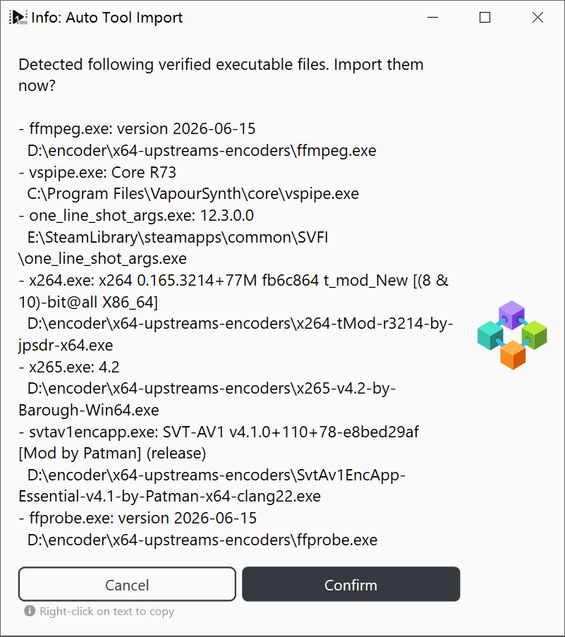

If missed, you can import manually or enable "Run auto-import on next open" in settings.

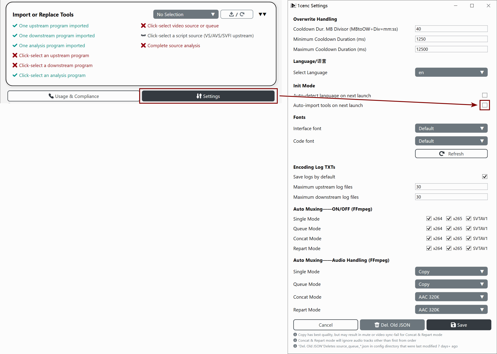

> If you want to open 1cenc.exe from elsewhere, you can create a shortcut or Start Menu entry.

1cenc auto-search will also attempt to locate system-installed VapourSynth and SVFI. The image below shows auto-import capturing 4 extracted and 2 installed tools simultaneously.

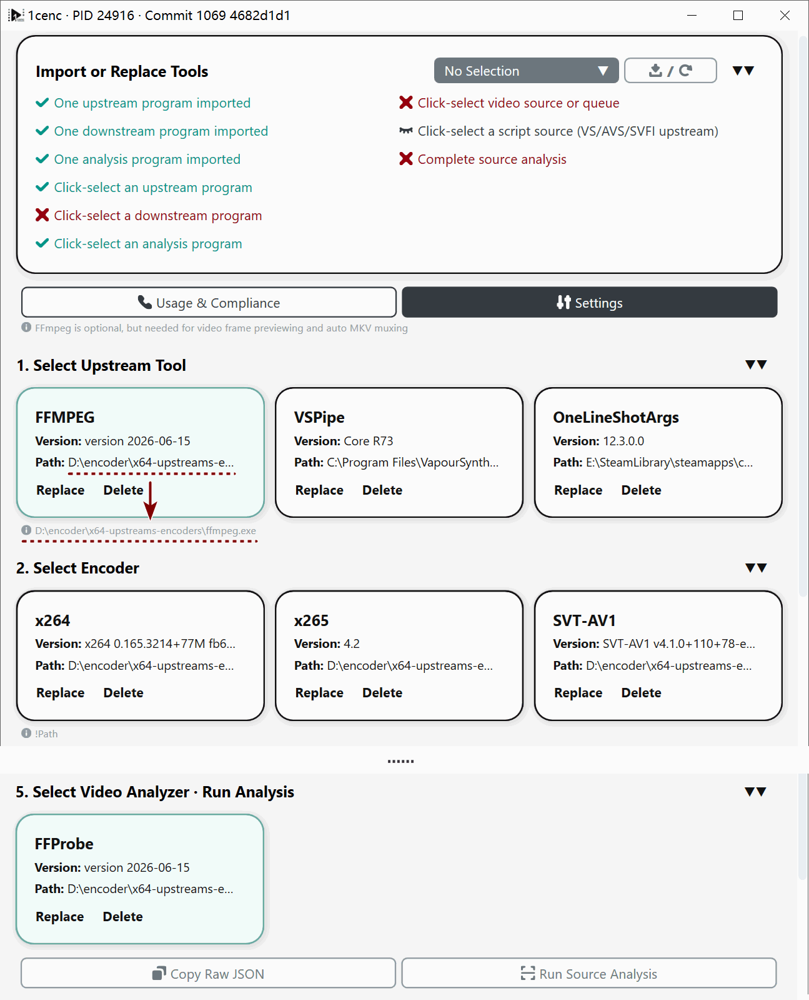

### First Launch — Main Interface Overview

The main interface consists of **titles**, **checklists**, **ItemCards**, and **buttons**. Tool ItemCards select items or open windows depending on their function.

#### Tool ItemCards

Interface building blocks featuring black borders, black text, and light gray backgrounds. They support collapsing, hovering, selection, and error states.
- Once familiar, collapsed state makes UI simpler to use
- If a tool shows an abnormal state (red border), re-import the tool

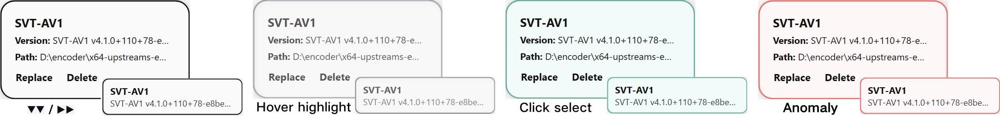

To handle long paths, tool ItemCards provide two display methods:
- A tooltip appearing on hover
- Hint text displayed below upon selection

#### Titles and Buttons

**Titles** show step sequences and instructions, including an expand/collapse button on the right.

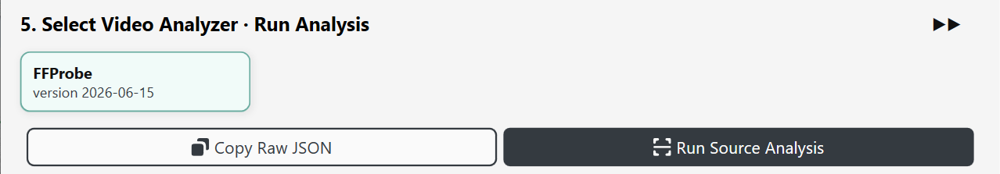

**Buttons** execute actions or open windows, disabling automatically if prerequisites fail.

> Note: "3. Select dependency file" is for AvsToPipeMod's AviSynth.dll dependency, which can be ignored.

#### Checklist

Checks tool selection, encoding unlock conditions, and potential video source issues.
- The checklist also supports collapse state
- Click list items to view details

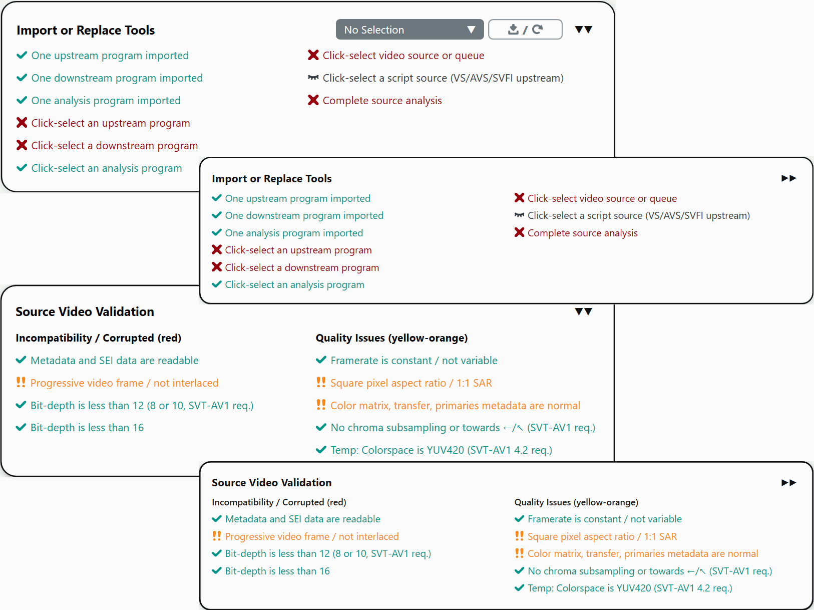

**4 Checklist Item States:**
- **Not checked** — black text, closed-eye icon: the check item is not relevant to the current workflow and is skipped
- **Passed** — green text, checkmark icon: normal or conditions met
- **Warning** — yellow text, double exclamation icon: may cause abnormal encoding results, but does not disable the "Start Encoding" button
- **Error** — red text, cross icon: base conditions not met or encoding cannot start; disables the "Start Encoding" button

#### Video Source ItemCard and Encoding Config ItemCard

These cards differ visually from the default white-background style due to their unique functions. Video source cards typically open a file selection window when clicked; encoding config cards typically open a configuration window.

**Video Source Card Functions:**
- **Video Source**: select a single video source
- **Video Queue**: select multiple video sources or Blu-ray PLAYLIST folders
- **Video Source Concat**: select multiple video sources, output a concatenated video
- **Video Source Repart**: select a video source folder (multiple sources) or Blu-ray PLAYLIST folder, specify split points, output multiple split or merged-then-split videos (can be simply understood as splitting)

---

### First Launch — Settings Overview

The settings page is the slowest window to open in 1cenc — due to font settings loading.

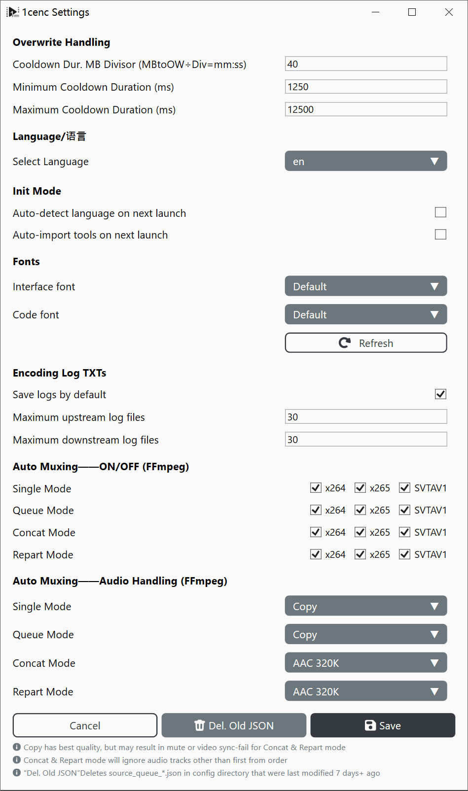

#### Defaults and Recommended Values

**Overwrite Handling — Cooldown MB Divisor**
- Calculates an overwrite cooldown duration based on file size.
- Recommended to keep default to prevent large files from being easily overwritten; minimum is 1

**Encoding Log TXTs**
- Saves runtime logs from upstream (FFmpeg, VapourSynth) and downstream (x264, x265, SVT-AV1) programs to files.
- Recommended to enable for troubleshooting; the default number is based on common TV Show episode counts (i.e., queue length)

**Auto Muxing**
- Multiplexes encoded video streams into `.mkv` containers.
- Since x265 comes without this capability (only exports `.hevc`) and may not keep frame rate metadata without parameter configuration, so it is recommended to keep x265 enabled
- x264 muxes to `.mp4`, SVT-AV1 muxes to lightweight `.ivf`; these formats have audio compatibility limitations, so disabling auto mux also disables the audio processing mechanism

**Auto Muxing — Audio Processing**
- Due to `.mkv`'s good compatibility and support by Adobe editing software, **single file** and **queue mode** are defaults to copy mode for best quality and fastest processing
- **Concat mode** and **repart mode** involve audio stream editing; some audio streams may not be supported, or may have limited support, so the default is set to re-encode
- Although re-encoding has Opus setting, the default is intentionally set to AAC due to its wider compatibility

---

## First Encode

1. Select FFmpeg
2. Select x264
3. Select a video source
    - 1cenc auto-analyzes new video sources; otherwise, click "Run Video Source Analysis".
    - FFProbe is automatically selected, so no manual selection is needed
4. Click "Start Encoding"
    - You can also click "Output Filename and Path" to adjust the output location

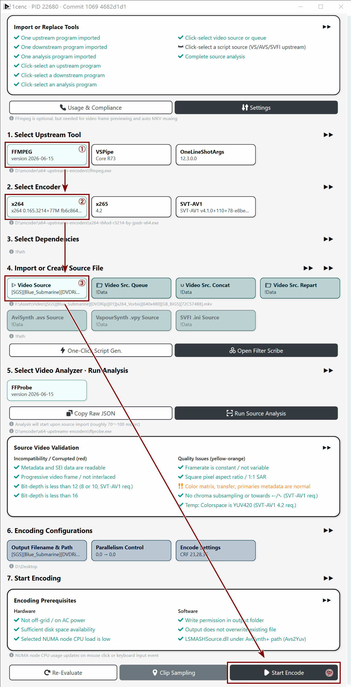

Clicking "Start Encoding" opens a parameter dialog supporting right-click text copying.
- The image shows a two-stage structure: **Encoding** → **Muxing**
    - i.e., "**Video Encoding** → **Audio Copy or Encode + Muxing**"
- In **concat mode** and **repart mode**, with auto mux audio processing set to "Re-encode to AAC/Opus", the encoding command becomes a three-stage structure
    - i.e., "**Video Encoding** → **Audio Encoding** → **Muxing**"
    - Parameters like `--master-display` indicate HDR metadata was recognized and converted.

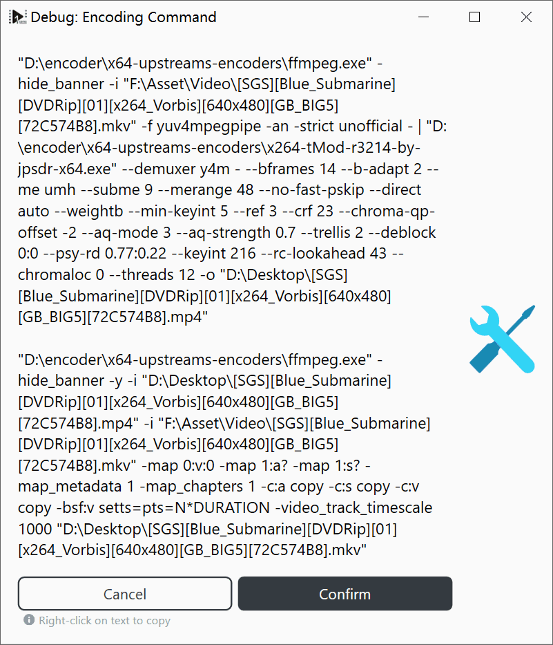

Confirming hides the main interface to save memory and opens the **Encoding Monitor**:

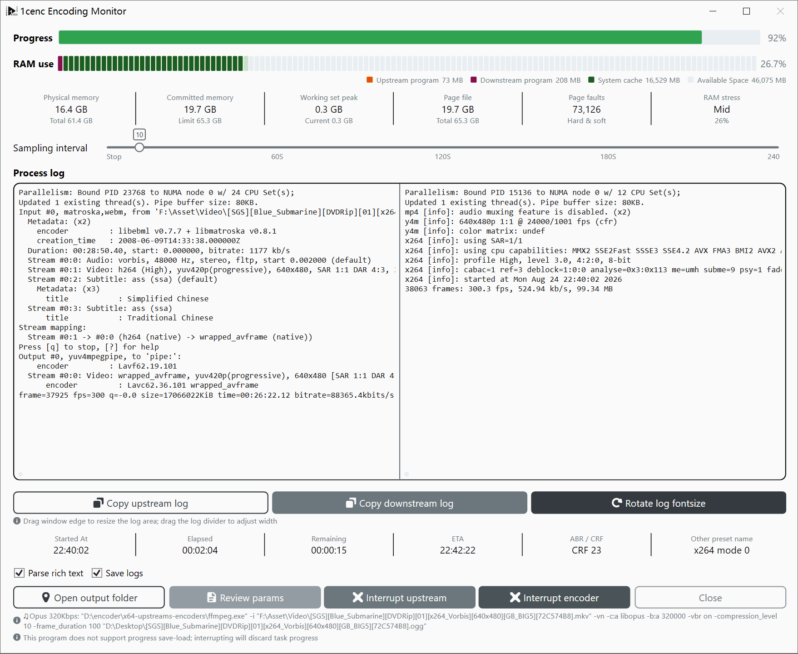

### First Encode — Encoding Monitor Overview

**Progress Bar**
- Displays a progress bar if total frames are known; otherwise, shows a barber pole animation.

**Memory Usage**
- Monitors system memory bottlenecks.
- Check if some programs should be closed to free more memory
- If the computer has multiple NUMA nodes, you can theoretically open several encoding processes

**Process Logs**
- Left side: upstream logs (FFmpeg, VapourSynth).
- Right side: downstream encoder logs.
- The divider in the middle can be dragged to resize the two windows
- Three buttons at the bottom can copy the current log text or cycle through font sizes

**Time Calculator**
- View elapsed time, estimated completion time, and other time status
- If the video metadata does not contain total frame count, estimated time information will not be updated

**Rich Text Parsing**
- Recognizes font, color, and other command symbols (SVT-AV1 writes these)

**Save Log**
- Saves the process logs from this encoding session as a `.txt` file in the `1cenc` directory

**Browse and Process Operations**
- **Interrupt Upstream / Downstream Program**
    - The upstream program handles decoding, so it completes more frames than the downstream program (encoder)
    - The choice depends on whether you want to encode a few more frames (interrupt upstream) or do a full stop (interrupt downstream)
- **Close**
    - Unlocked after both upstream and downstream programs have been interrupted / exited

After encoding completes, 1cenc will start the auto mux operation, producing a second segment of upstream program log:

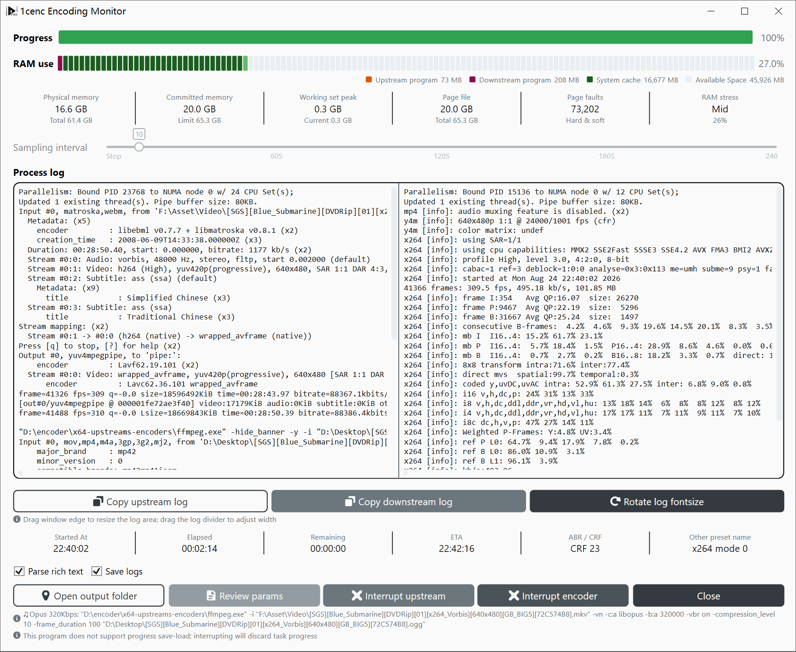

---

## Second Encode (Full Workflow)

***Follow the configuration / click sequence shown in the image below to re-run this encoding:***

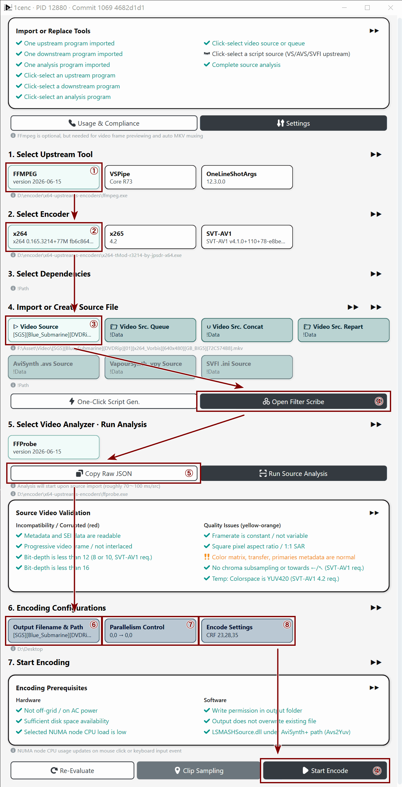

### Second Encode ④ — Filter Editor Overview

Filter editor buttons unlock after analysis completes, as some lines rely on source data.
- The filter editor automatically selects the tab (the upstream program here is ffmpeg)

Parameters show "N/A" if unneeded; fixes for variable frame rates or non-square pixels generate automatically.

***Follow the image below to generate a scale-down command using the resolution scaling controls, then paste it into the filter parameter box at the top and click Confirm.***

When clicking Confirm to save, an "Overwrite ffprobe JSON" confirmation dialog will appear. This occurs because resolution changes require encoding parameter recalibration.

***Click "Update ffprobe JSON".***

> Note: VapourSynth filter editor supports single-frame filter effect preview

### Second Encode ⑤ — Copy Raw JSON

When 1cenc makes strange checklist judgments or triggers unexpected warnings, you can use this to troubleshoot.

***(Optional) Open your preferred text editor, paste it in, and inspect it***

### Second Encode ⑥ — Output Filename and Path

Previews filename appearance across UI widths to prevent encoding failures, aiding bulk file management.

Set a new filename and specify a new output location here.

### Second Encode ⑦ — Parallelism Scheduling

Configures NUMA node assignments for multi-node processors or custom BIOS setups.

**Limit Upstream / Downstream Program Threads to Physical Core Count**
- Encoders are typically compute-heavy and cache-light.
    - Limiting to physical cores achieves an HPC-style speedup without losing hyperthreading benefits.
- This enhances 1cenc speed and stability over generic encoders.

**Pipe Buffer**
- Theoretically increases cache usage; negligible practical impact, safe to ignore.

***You can keep the defaults or check all items here, then confirm***

### Second Encode ⑧ — Encoding Parameters (and Preview)

Configure and preview encoder / downstream program parameters here:
1. Select a CRF value using the **CRF Scale** hint.
2. Select a source-relevant preset in **Custom Parameters — Base Parameters**.
3. Set a playback-appropriate keyframe interval in **Custom Parameters — Keyframe Interval Seconds**.
4. (Ignore other settings)
5. Click **Preview** in the right window and wait for completion.
    1. Wait for the current frame encoding to complete
    2. (Optional) Wait for the SSIMULACRA and Butteraugli quality scores in blue text at the bottom right to finish
6. Drag the divider between SOURCE and ENCODE for precise comparison
7. (Optional) Drag the **Frame Position** progress bar to preview again
8. (Optional) Change the **encoder** in the top-left corner of the preview window and preview again

***Adjust CRF mode parameter values, select base parameters, and keyframe interval according to the instructions above, then click Confirm at the bottom of the left panel***

### Second Encode — Clip Sampling

Specify a segment of the video to encode. Trims intros/outros for sample testing and quality review.

***Try using the duration slider to expand the segment to 60 seconds, drag the yellow portion on the timeline to the beginning, and click "Start Sampling"***

After confirming "Start Sampling", a debug window will pop up, but this time no muxing command will appear.

***Click Confirm to start encoding***

---

## Basic Workflow Tutorial Complete

### Unmentioned Content (Advanced Use Cases)

- Blu-ray chapter import
- Video source queue mode
- Video source concat mode
- Video source repart mode (basic splitting, over-segmented BD repartition, conjoined BD repartition)
- Basic AviSynth and VapourSynth filter processing with queue, concat, and repart mode variations
- Multi-NUMA-node multi-instance strategies (title PID numbers, source folder splitting, queue splitting)
