# 1cenc 基本ワークフローチュートリアル

このドキュメントは初心者を対象としており、ダウンロードからエンコードまでのワークフローを説明します。

**問題の報告方法**
- 問題は [GitHub Issues](https://github.com/iAvoe/OneColumnEncoder/issues) または [NazoRip コメント欄](https://nazorip.site/archives/1593/) から報告できます。報告する前に、問題が本当に 1cenc に起因することを確認してください。トラブルシューティングに役立つ、スクリーンショット、実行時ログのコピー、ffprobe ログなどの補足情報を含めることをお勧めします。

## ダウンロードと「インストール」

1cenc を実行するには、少なくとも Windows 10 バージョン 1607 以降が必要です。バージョン 1809 / 21H2 (LTSC) 以上を推奨します。
- 64bit OS: `1cenc-win-x64.7z` をダウンロード
- 32bit OS: `1cenc-win-x86.7z` をダウンロード
- 一般的な使用には 32bit バージョンは推奨されません

> 一部のバンドルツールには 32bit 版がなく、機能が制限されます。

### ダウンロードと「インストール」— 解凍後のファイル一覧


- `1cenc` フォルダ：バンドルツール、キューリストデータ、エンコード実行ログ、設定などのデータ
- `OneColumnEncoder.exe`：メインプログラム
- `OneColumnEncoder.pdb`：デバッグ情報（問題報告時にアップロード）
- `x64-upstreams-encoders.7z`：FFmpeg、FFprobe、x264 などの**動画処理ツール**を含むアーカイブ
    - これらのツールはサイズが大きく（GitHub の制限に引っかかるため）、別途解凍する必要があります
    - 32bit OS の場合は `x86-upstreams-encoders.7z` を使用します

**バンドルされている動画処理ツール**
- `ffmpeg.exe`：動画デコード、ffmpeg フィルター、動画フレームエンコードプレビュー、リパートエディタ分割プレビュー、自動マルチプレクス
- `ffprobe.exe`：動画ソース解析（エンコーダーパラメータの一部生成、フォーマット互換性や破損のチェック）
- `x264[...].exe`：AVC ビデオエンコーダー
- `x265[...].exe`：HEVC ビデオエンコーダー
- `SvtAv1EncApp[...].exe`：AV1 ビデオエンコーダー

> すべてのツールを含む 1cenc は 350MB を超えます。主な理由は FFmpeg と内蔵の .NET 9.0 依存関係によるものです。軽量インストールの場合は、AI に依頼してソースからコンパイルすることもできます。
> ツールの詳細な説明については、動画エンコードツールのダウンロードチュートリアルを参照してください：[NazoRip](https://nazorip.site/archives/1482)；[GitHub](https://github.com/iAvoe/encoding-tools-download-tutorial)

**その他のツール**
- `x64-AVS-VS-plugins`：AviSynth および VapourSynth ビデオフィルター（AviSynth と VapourSynth のインストールとインポートが必要）
- `x64-CloudinarySSIMULACRA2.1|GoogleButteraugli`：画像品質スコアリングツール。プレビューでのエンコードパラメータの影響をリアルタイムで確認するために使用

#### 動画処理ツールの配置

`.exe` ツールはどこに置いても構いませんが、1cenc は以下の場所から自動的にインポートします：

>     .
>     ├── ①
>     ├── OneColumnEncoder.exe
>     ├── OneColumnEncoder.pdb
>     ├── x64-upstreams-encoders
>     │    └── ②
>     └── 1cenc
>          ├── ③
>          ├── x64-upstreams-encoders
>          │   └── ④
>          ├── x64-AVS-VS-plugins
>          │   └── ...
>          ├── x64-CloudinarySSIMULACRA2.1
>          │   └── ...
>          └── x64-GoogleButteraugli
>             └── ...
>


---

## AviSynth+ と LSMASH のインストール（オプション）

AviSynth フィルターを使用する場合は、この手順を行ってください。

### ダウンロード

- [AviSynth+ リリースページ（GitHub）](https://github.com/AviSynth/AviSynthPlus/releases)
  - システムタイプに応じてビルドターゲットのサフィックスを選択してください
  - x86 アーキテクチャ CPU + Windows 64bit → AviSynthPlus_x.y.z_yyyymmdd.exe
- [L-SMASH-Works フィルター（GitHub）](https://github.com/HomeOfAviSynthPlusEvolution/L-SMASH-Works/releases/)

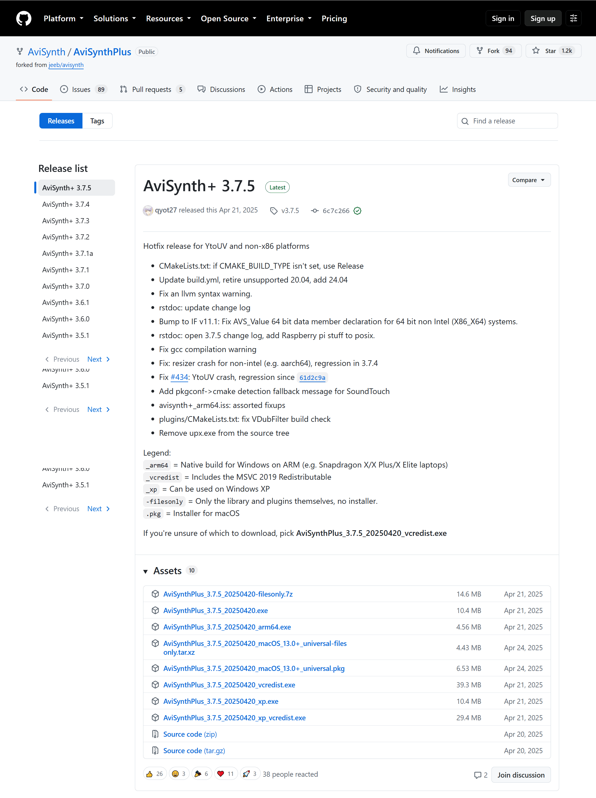

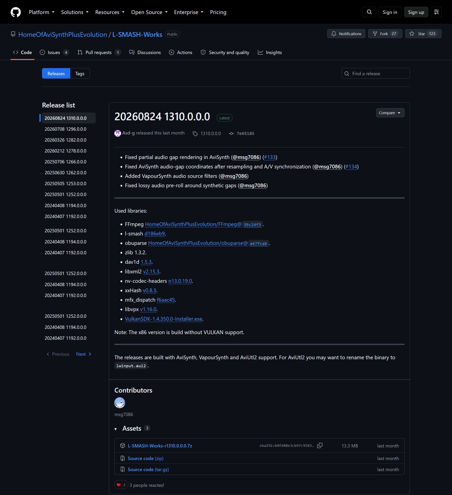

### インストール

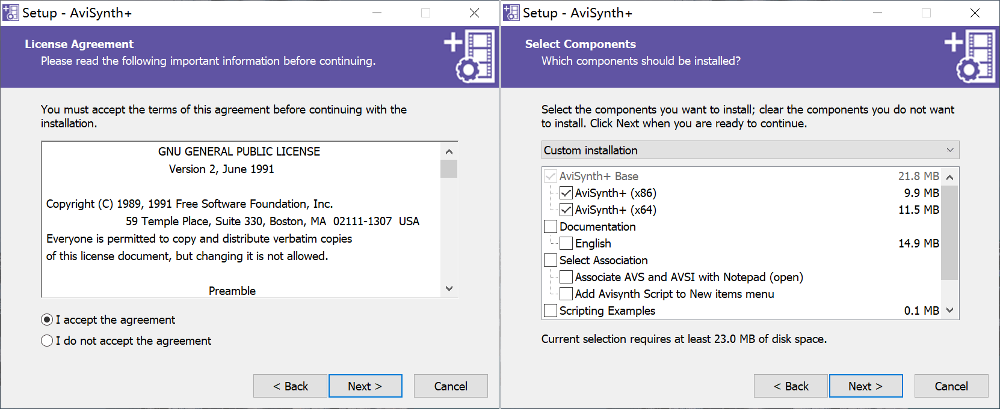

1. AviSynth+ をインストールします。AviSynth+ Base のみをインストールすることもできます。
2. `L-SMASH-Works-rXXXX....7z` アーカイブ内の `LSMASHSource.dll` を対応するフォルダーにコピーします。

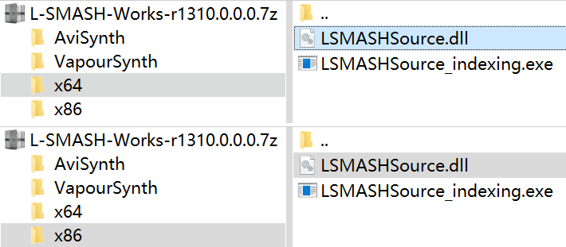

```
C:\Program Files (x86)\AviSynth+
├── ...
├── plugins
├── plugins+
│   └── LSMASHSource.dll ← L-SMASH-Works-rXXXX....7z/x86/
├── plugins64
└── plugins64+
    └── LSMASHSource.dll ← L-SMASH-Works-rXXXX....7z/x64/
```

> 注意：これは `libvslsmashsource.dll` ではありません。

---

## Python、VapourSynth、libvslsmashsource のインストール

VapourSynth フィルターを使用し、かつ 64bit OS を使用している場合は、この手順を行ってください。

1cenc に付属するフィルターは最新版の VapourSynth と互換性がない場合がありますが、安定を重視するなら避けるべきです。ただし、新バージョンは性能が良い傾向にあるため、同様に推奨されます。
- 確認済み環境：Python 3.13.7、3.14.7；VapourSynth Core R71、R73

> 新版 VapourSynth で互換性の問題が発生した場合は、[GitHub Issues](https://github.com/iAvoe/OneColumnEncoder/issues) まで報告してください。

### Python のダウンロードとインストール

VapourSynth は Python 環境上で動作します。以下の表を参照するか、直接 3.14.x を使用してください。
- [Python ダウンロードページ—Windows](https://www.python.org/downloads/windows/)

| VapourSynth | Windows 対応の Python |
| --- | --- |
| **R71**     | *3.8、3.13*  |
| **R72**     | *3.8、3.12+* |
| **R73**     | *3.8、3.12+* |
| **R74→R80** | *3.12+*      |

ダウンロード時には、システムのビット数（x86/64）に応じてバージョンを選択し、"Installer" をダウンロードしてください：
| タイプ | 説明 | 対象範囲 | 推奨 |
| --- | --- | --- | --- |
| **Installer** | 伝統的な `.exe` インストールプログラム | 一般的な Windows ユーザー | ✅ |
| **Embeddable package** | 簡易埋め込み Python ランタイム ZIP | ソフトウェア開発者、プログラムに Python をバンドルする場合 | ❌ |
| **MSI package** | Windows Installer `.msi` パッケージ | 企業デプロイ、管理者、自動化インストール | ⚠️ |
| **Installer (MSIX)** | モダン MSIX アプリパッケージ for Windows | Microsoft Store / モダンな Windows アプリデプロイ | ⚠️ |

インストーラーで **Add python.exe to Path に必ずチェックを入れてください**。そうしないと VapourSynth は Python を呼び出せません。

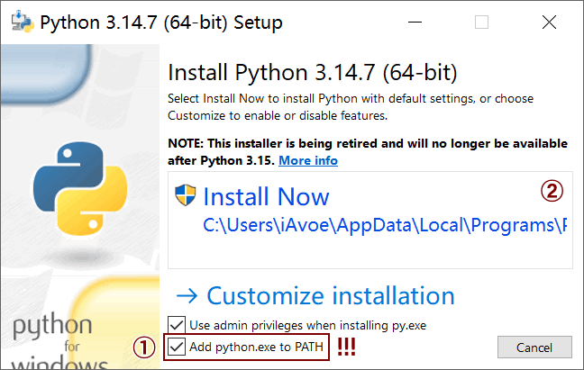

> インストールプログラムのスクリーンショットに "(64 bit)" と表示されている場合、正しいバージョンです。表示されていない場合は、ダウンロードページに戻って間違えていないか確認してください。

### ダウンロード

- [VapourSynth リリースページ（GitHub）](https://github.com/vapoursynth/vapoursynth/releases)
  - Portable：ポータブル版で、手動でインストール手順（システム変数の追加など）が必要です。推奨しません。
   
- [LSMAS フィルター GitHub/AkarinVS](https://github.com/AkarinVS/L-SMASH-Works/releases)
  - デコーダーは動画ソースのインデックスファイル（キャッシュファイル）を作成します。保存先パスに応じてバージョンを選択してください。
    - tmp：`cachedir=%TEMP%`、OS 設定に基づいてキャッシュドライブを指定します。Windows の場合は通常 C: ドライブです。
      - 推奨 — システムクリーンアップ時に自動的に削除される可能性が高いです。
    - src：`cachedir=""`、コマンドウィンドウの現在のパスです。
      - Windows のデフォルトは C: ドライブです。
    - cwd：`cachedir="."`、実行時のコマンドライン パスです。
      - CMD/PowerShell/Bash を開いたときの初期パスです。

> 以前にダウンロードした `LSMASHSource.dll` でも動作する可能性がありますので、試してみてください。

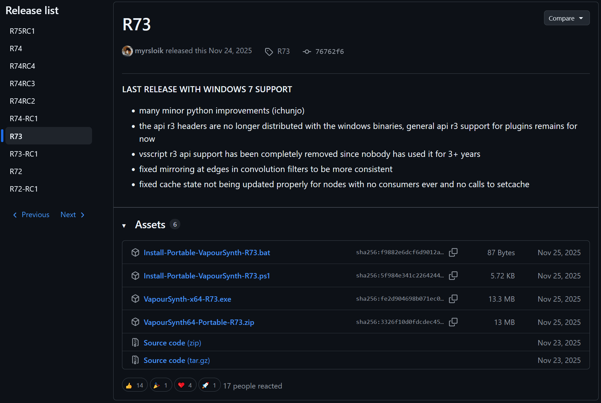

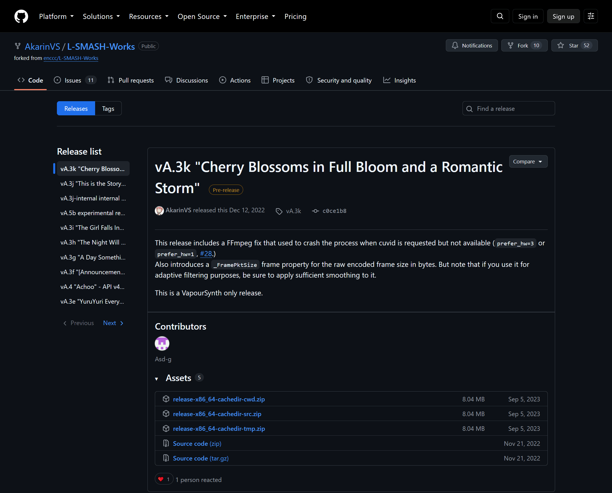

### インストール

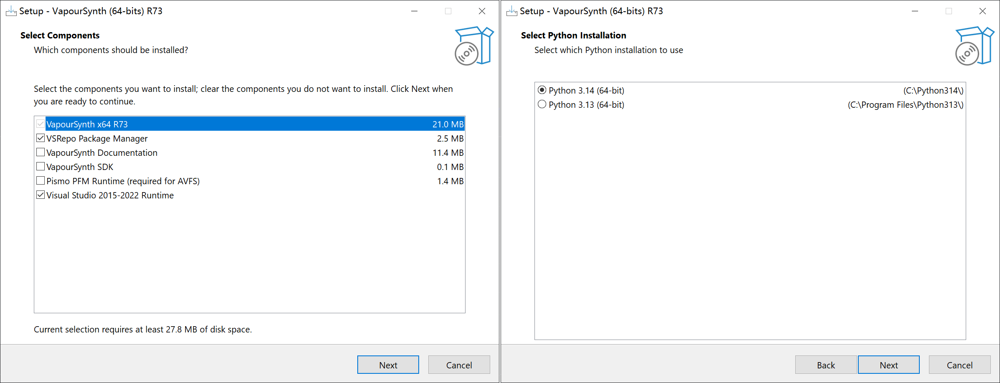

1. VapourSynth をインストールします。インストール画面の 2 ページ目に、システムに存在する Python 環境が一覧表示されます。
     - 以前にインストールした Python が一覧にない場合は、やり直してください。
2. アーカイブ内の `libvslsmashsource.dll` を `C:\Program Files\VapourSynth\plugins` フォルダーにコピーします。
3. CMD または PowerShell を開き、`vspipe --version` を実行して確認します。

---

## 初回起動

`1cenc.exe` をダブルクリックして開きます。初回起動時に自動インポートを実行するか確認されます。「確認」をクリックして自動インポートを実行します：

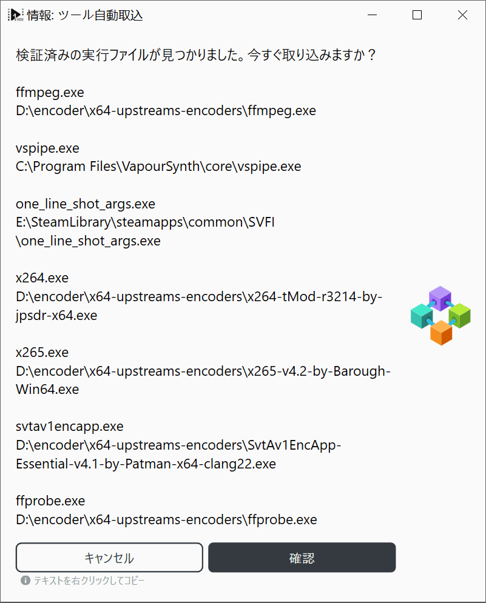

もし見逃した場合は、手動でインポートするか、設定で「次回起動時に自動インポートを実行」を有効にできます。

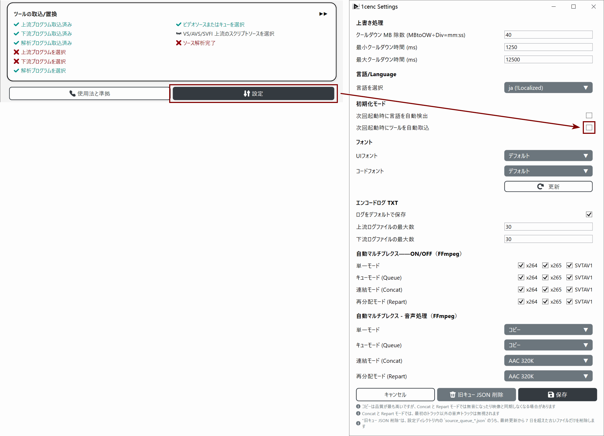

> 1cenc.exe を別の場所から開きたい場合は、ショートカットまたはスタートメニューエントリを作成できます。

1cenc の自動検索は、システムにインストールされた VapourSynth や SVFI も検出しようとします。下の画像は、自動インポートが 4 つの解凍済みツールと 2 つのインストール済みツールを同時に検出した例です。

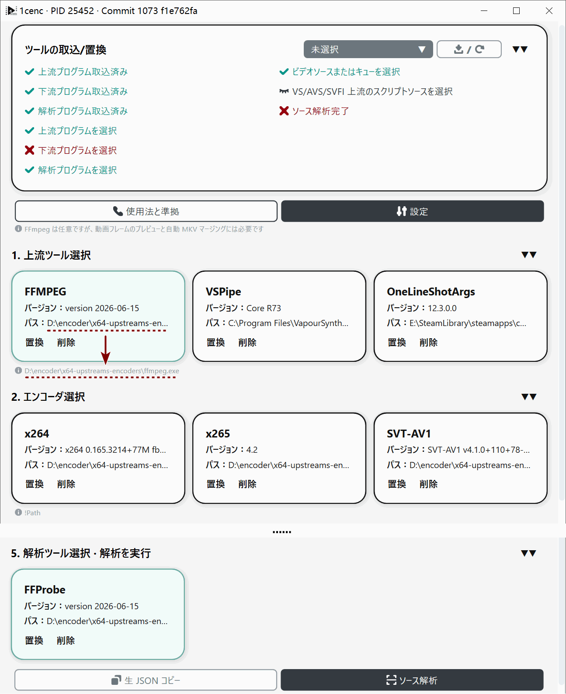

### 初回起動 — メインインターフェースの概要

メインインターフェースは、**タイトル**、**チェックリスト**、**アイテムカード**、**ボタン**で構成されています。ツールアイテムカードは、その機能に応じてアイテムを選択したり、ウィンドウを開いたりします。

#### ツールアイテムカード

黒い枠線、黒いテキスト、薄いグレーの背景を持つインターフェースの構成要素です。折りたたみ、ホバー、選択、エラー状態をサポートします。
- 使い慣れてくると、折りたたみ状態の方が UI がシンプルになります
- ツールが異常な状態（赤い枠）を示している場合は、ツールを再インポートしてください

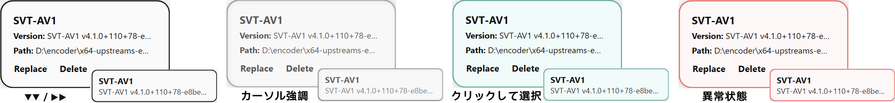

長いパスに対処するため、ツールアイテムカードには 2 つの表示方法があります：
- ホバー時に表示されるツールチップ
- 選択時に下部に表示されるヒントテキスト


#### タイトルとボタン

**タイトル**はステップの順序と説明を示し、右側に展開/折りたたみボタンを含みます。

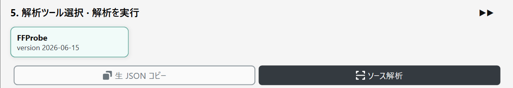

**ボタン**はアクションを実行したりウィンドウを開いたりしますが、前提条件が満たされていない場合は自動的に無効化されます。

> 注意：「3. 依存ファイルを選択」は AvsToPipeMod の AviSynth.dll 依存関係用であり、無視しても構いません。

#### チェックリスト

ツールの選択、エンコード開始条件、および潜在的な動画ソースの問題をチェックします。
- チェックリストも折りたたみ状態をサポートします
- リスト項目をクリックして詳細を表示します

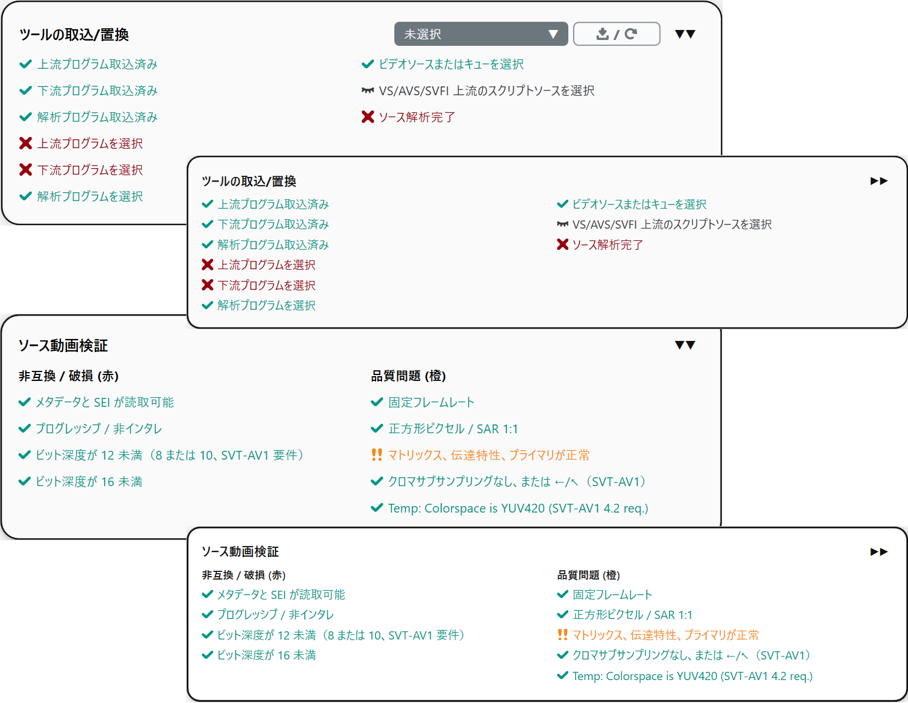

**4 つのチェックリスト項目の状態：**
- **未チェック** — 黒いテキスト、閉じた目のアイコン：現在のワークフローに関連しないためスキップされます
- **合格** — 緑のテキスト、チェックマークアイコン：正常または条件を満たしています
- **警告** — 黄色のテキスト、二重感嘆符アイコン：エンコード結果が異常になる可能性がありますが、「エンコード開始」ボタンは無効になりません
- **エラー** — 赤いテキスト、×アイコン：基本条件を満たしておらず、エンコードを開始できません。「エンコード開始」ボタンを無効にします

#### 動画ソースアイテムカードとエンコード設定アイテムカード

これらのカードは、機能が異なるため、デフォルトの白背景スタイルとは視覚的に異なります。動画ソースカードは通常、クリックするとファイル選択ウィンドウを開きます。エンコード設定カードは通常、設定ウィンドウを開きます。


**動画ソースカードの機能：**
- **ビデオソース**：単一の動画ソースを選択
- **ビデオキュー**：複数の動画ソースまたは Blu-ray PLAYLIST フォルダを選択
- **ビデオソース連結（Concat）**：複数の動画ソースを選択し、連結された 1 つの動画を出力
- **ビデオソースリパート（Repart）**：動画ソースフォルダ（複数ソース）または Blu-ray PLAYLIST フォルダを選択し、分割ポイントを指定して、複数の分割動画または結合後に分割された動画を出力（簡単に言うと分割機能）

---

### 初回起動 — 設定の概要

設定ページは 1cenc で最も開くのが遅いウィンドウです — フォント設定の読み込みが原因です。

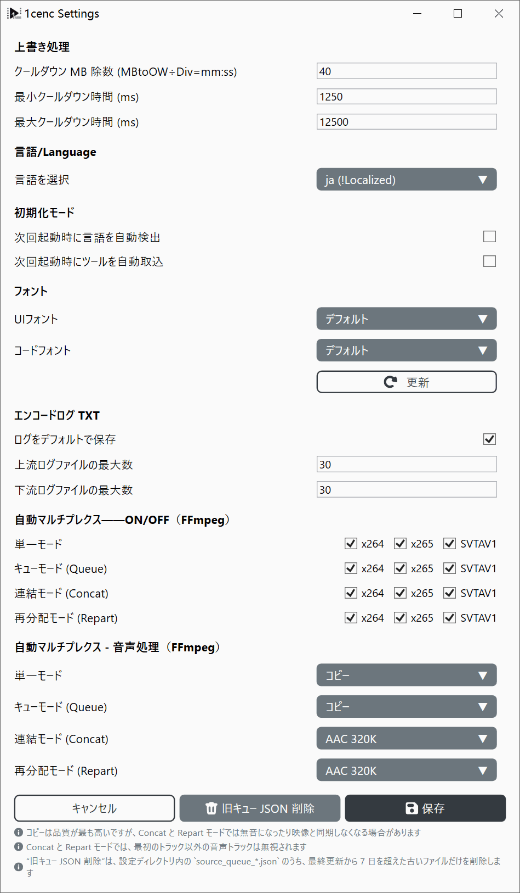

#### デフォルト値と推奨値

**上書き処理 — クールダウン MB 除数**
- ファイルサイズに基づいて上書きクールダウン時間を計算します。
- デフォルトのままにすることを推奨します。大規模ファイルが簡単に上書きされるのを防ぐためです。最小値は 1 です。

**エンコードログ TXT**
- 上流（FFmpeg、VapourSynth）および下流（x264、x265、SVT-AV1）プログラムの実行時ログをファイルに保存します。
- トラブルシューティングのために有効にすることを推奨します。デフォルトの数は一般的な TV シリーズのエピソード数（つまりキュー長）に基づいています。

**自動マルチプレクス**
- エンコードされたビデオストリームを `.mkv` コンテナに多重化します。
- x265 にはこの機能がなく（`.hevc` のみ出力）、パラメータ設定なしではフレームレートメタデータが保持されない可能性があるため、x265 では有効にすることを推奨します。
- x264 は `.mp4`、SVT-AV1 は軽量な `.ivf` にマルチプレクスします。これらの形式には音声互換性の制限があるため、自動マルチプレクスを無効にすると音声処理メカニズムも無効になります。

**自動マルチプレクス — 音声処理**
- `.mkv` は互換性が高く、Adobe 編集ソフトウェアにもサポートされているため、**単一ファイル**および**キューモード**ではデフォルトでコピーモード（最高品質・最速処理）が設定されています。
- **連結モード**および**リパートモード**では音声ストリームの編集が伴い、一部の音声ストリームはサポートされていないか、サポートが制限される可能性があるため、デフォルトは再エンコードに設定されています。
- 再エンコードには Opus 設定もありますが、互換性を優先してデフォルトは AAC に意図的に設定されています。

---

## 初めてのエンコード

1. FFmpeg を選択
2. x264 を選択
3. 動画ソースを選択
    - 1cenc は新しい動画ソースを自動解析します。それ以外の場合は「動画ソース解析を実行」をクリックします。
    - FFProbe は自動的に選択されるため、手動で選択する必要はありません。
4. 「エンコード開始」をクリック
    - 「出力ファイル名とパス」をクリックして出力先を調整することもできます

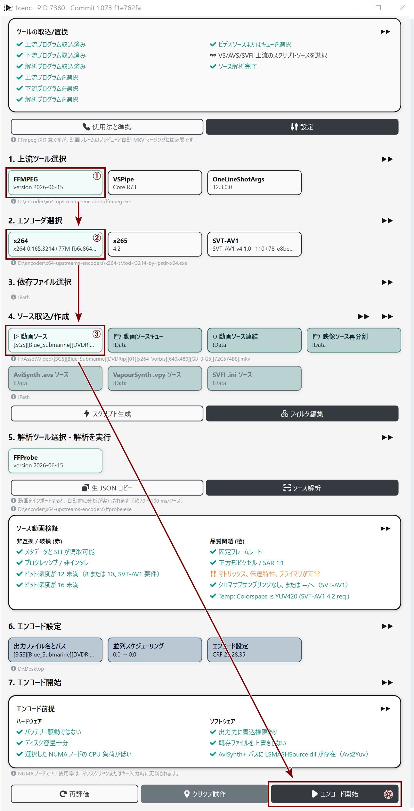

「エンコード開始」をクリックすると、パラメータダイアログが開きます。右クリックでテキストをコピーできます。
- 画像は 2 段階の構造を示しています：**エンコード** → **マルチプレクス**
    - すなわち、「**ビデオエンコード** → **音声コピーまたはエンコード + マルチプレクス**」
- **連結モード**および**リパートモード**で、自動マルチプレクスの音声処理が「AAC/Opus に再エンコード」に設定されている場合、エンコードコマンドは 3 段階構造になります。
    - すなわち、「**ビデオエンコード** → **音声エンコード** → **マルチプレクス**」
- `--master-display` などのパラメータは、HDR メタデータが認識され変換されたことを示します。

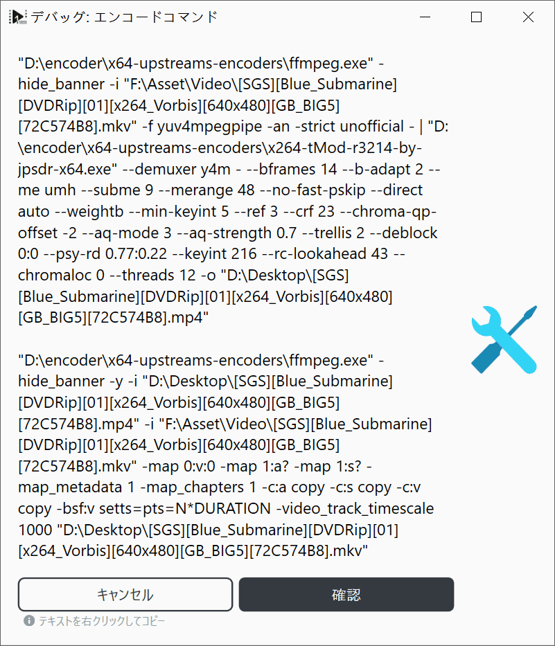

確認すると、メインインターフェースはメモリ節約のために非表示になり、**エンコードモニター**が開きます：

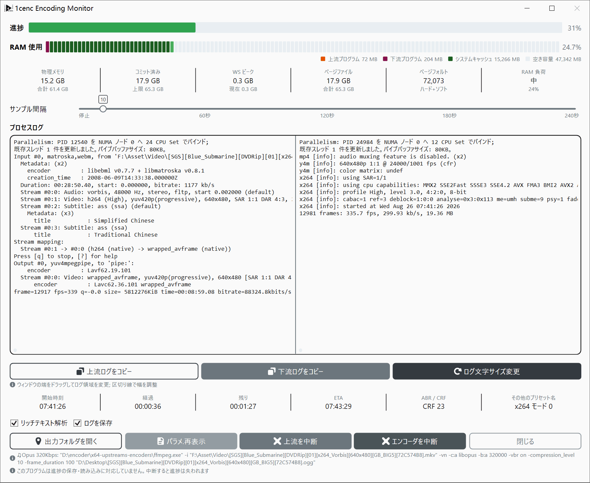

### 初めてのエンコード — エンコードモニターの概要

**プログレスバー**
- 総フレーム数がわかっている場合はプログレスバーを表示し、それ以外の場合はバーバーポールアニメーションを表示します。

**メモリ使用量**
- システムメモリのボトルネックを監視します。
- メモリを解放するために閉じるべきプログラムがあるか確認します。
- コンピュータに複数の NUMA ノードがある場合、理論的には複数のエンコードプロセスを開くことができます。

**プロセスログ**
- 左側：上流プログラム（FFmpeg、VapourSynth）のログ。
- 右側：下流エンコーダーのログ。
- 中央の仕切りはドラッグして 2 つのウィンドウのサイズを変更できます。
- 下部の 3 つのボタンで現在のログテキストをコピーしたり、フォントサイズを切り替えたりできます。

**タイム計算機**
- 経過時間、推定完了時間などの時間ステータスを表示します。
- 動画メタデータに総フレーム数が含まれていない場合、推定時間情報は更新されません。

**リッチテキスト解析**
- フォント、色、その他のコマンド記号（SVT-AV1 が出力します）を認識します。

**ログ保存**
- このエンコードセッションのプロセスログを `1cenc` ディレクトリ内の `.txt` ファイルとして保存します。

**参照とプロセス操作**
- **上流/下流プログラムの中断**
    - 上流プログラムはデコードを担当するため、下流プログラム（エンコーダー）よりも多くのフレームを処理します。
    - 選択は、さらに数フレームをエンコードするか（上流を中断）、完全に停止するか（下流を中断）によって異なります。
- **閉じる**
    - 上流プログラムと下流プログラムの両方が中断/終了した後にロックが解除されます。

エンコードが完了すると、1cenc は自動マルチプレクス操作を開始し、2 番目のセグメントの上流プログラムログが生成されます：

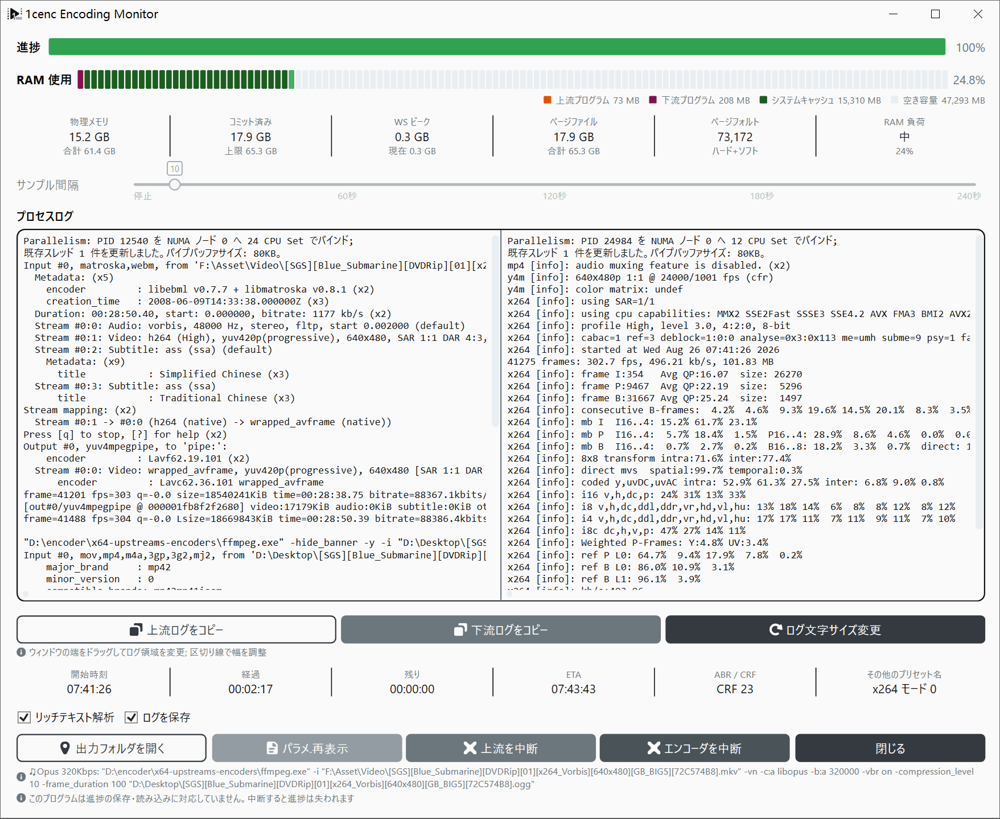

---

## 2 回目のエンコード（完全ワークフロー）

***以下の画像の設定/クリック順に従って、このエンコードを再実行します：***

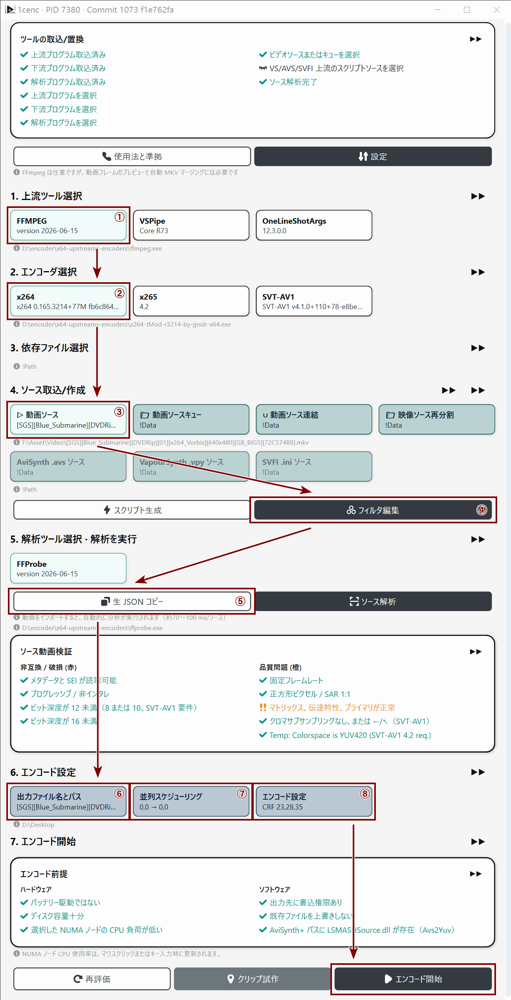

### 2 回目のエンコード ④ — フィルターエディターの概要

フィルターエディターのボタンは、解析が完了するとロックが解除されます。これは、一部の行がソースデータに依存するためです。
- フィルターエディターは自動的にタブを選択します（ここでは上流プログラムは ffmpeg です）

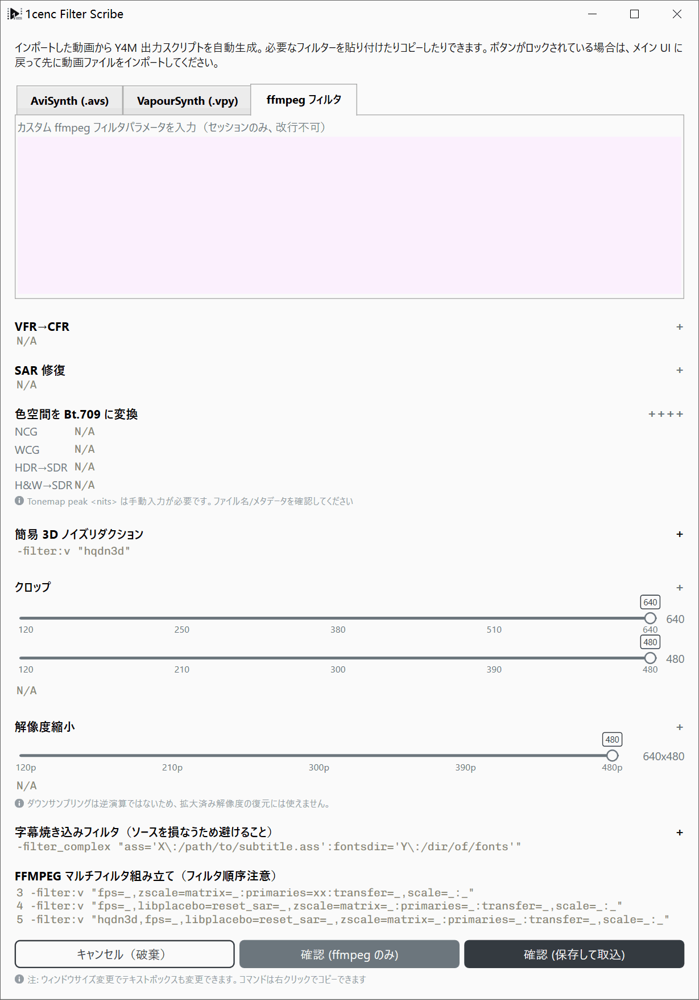

不要なパラメータは「N/A」と表示されます。可変フレームレートや非正方形ピクセル（SAR 修正が必要）などの修正は自動的に生成されます。

***以下の画像に従って、解像度スケーリングコントロールを使用して縮小コマンドを生成し、それをフィルターパラメータボックスに貼り付けて、「確認」をクリックします。***

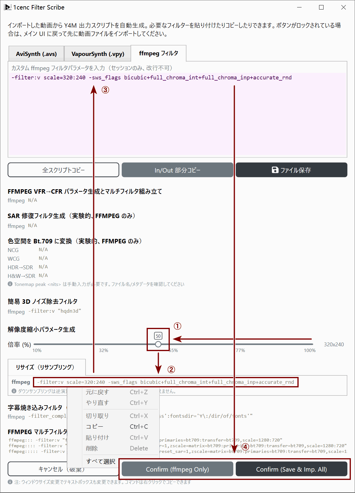

「確認」をクリックして保存すると、「ffprobe JSON を上書き」確認ダイアログが表示されます。これは、解像度変更によりエンコードパラメータの再調整が必要になるためです。

***「ffprobe JSON を更新」をクリックします。***

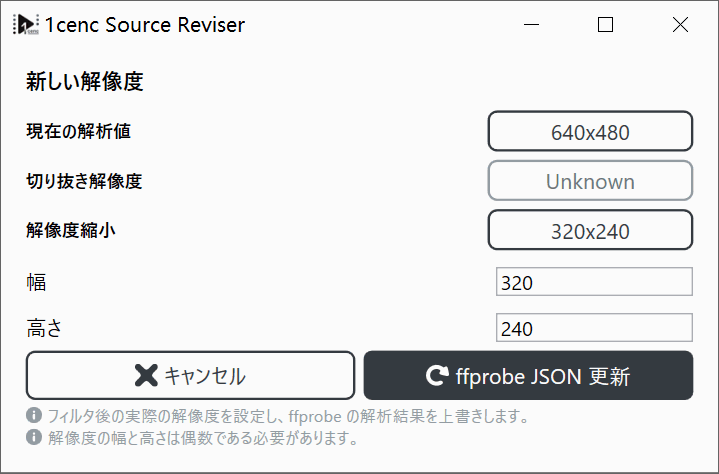

> 注意：VapourSynth フィルターエディターは、単一フレームのフィルター効果プレビューをサポートしています。

### 2 回目のエンコード ⑤ — 生 JSON のコピー

1cenc が奇妙なチェックリスト判断をしたり、予期しない警告をトリガーしたりした場合、トラブルシューティングにこれを使用できます。

***（任意）お好みのテキストエディタを開き、貼り付けて確認します。***

### 2 回目のエンコード ⑥ — 出力ファイル名とパス

さまざまな UI 幅でのファイル名の表示をプレビューし、エンコード失敗を防ぎ、バルクファイル管理に役立てます。

ここで新しいファイル名を設定し、新しい出力場所を指定します。

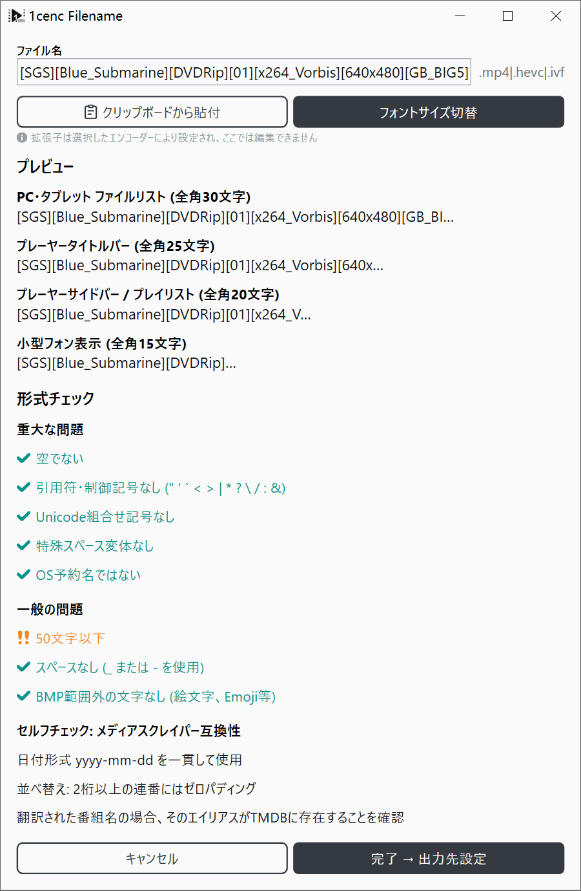

### 2 回目のエンコード ⑦ — 並列スケジューリング

マルチノードプロセッサやカスタム BIOS 設定のための NUMA ノード割り当てを設定します。

**上流/下流プログラムのスレッドを物理コア数に制限**
- エンコーダーは一般的に計算負荷が高く、キャッシュは軽量です。
    - 物理コアに制限することで、ハイパースレッディングの利点を失うことなく、HPC スタイルの高速化を実現できます。
- これにより、1cenc は一般的なエンコーダーよりも高速かつ安定します。

**パイプバッファ**
- 理論的にはキャッシュ使用量が増加しますが、実際の影響は無視できる程度であり、安全に無視できます。

***ここではデフォルトのままにするか、すべての項目にチェックを入れてから確認します。***

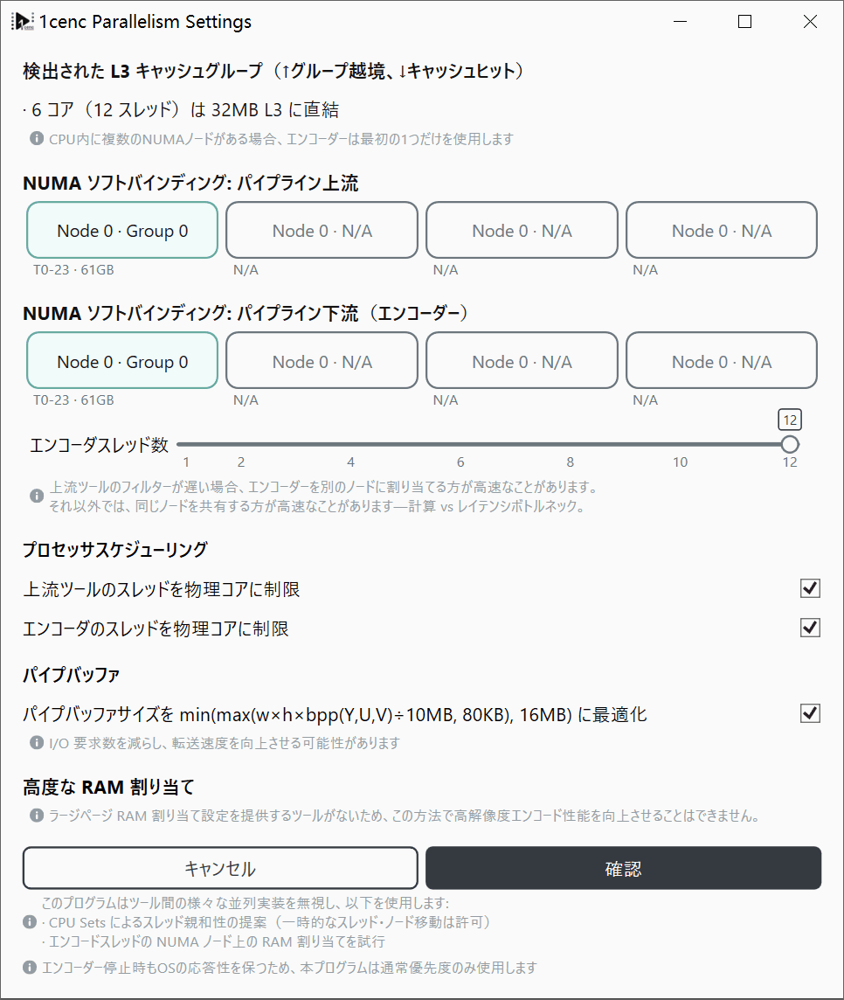

### 2 回目のエンコード ⑧ — エンコードパラメータ（およびプレビュー）

ここでエンコーダー/下流プログラムのパラメータを設定およびプレビューします：
1. **CRF スケール**のヒントを使用して CRF 値を選択します。
2. **カスタムパラメータ — ベースパラメータ**で、ソースに関連するプリセットを選択します。
3. **カスタムパラメータ — キーフレーム間隔（秒）**で、再生環境に適した値を設定します。
4. （他の設定は無視します）
5. 右側のウィンドウで**プレビュー**をクリックし、完了を待ちます。
    1. 現在のフレームのエンコードが完了するのを待ちます。
    2. （任意）右下の青色テキストで SSIMULACRA および Butteraugli 品質スコアが完了するのを待ちます。
6. SOURCE と ENCODE の間の仕切りをドラッグして、正確に比較します。
7. （任意）**フレーム位置**プログレスバーをドラッグして再度プレビューします。
8. （任意）プレビューウィンドウの左上隅で**エンコーダー**を変更し、再度プレビューします。

***上記の手順に従って CRF モードパラメータ値を調整し、ベースパラメータとキーフレーム間隔を選択したら、左パネル下部の確認をクリックします。***

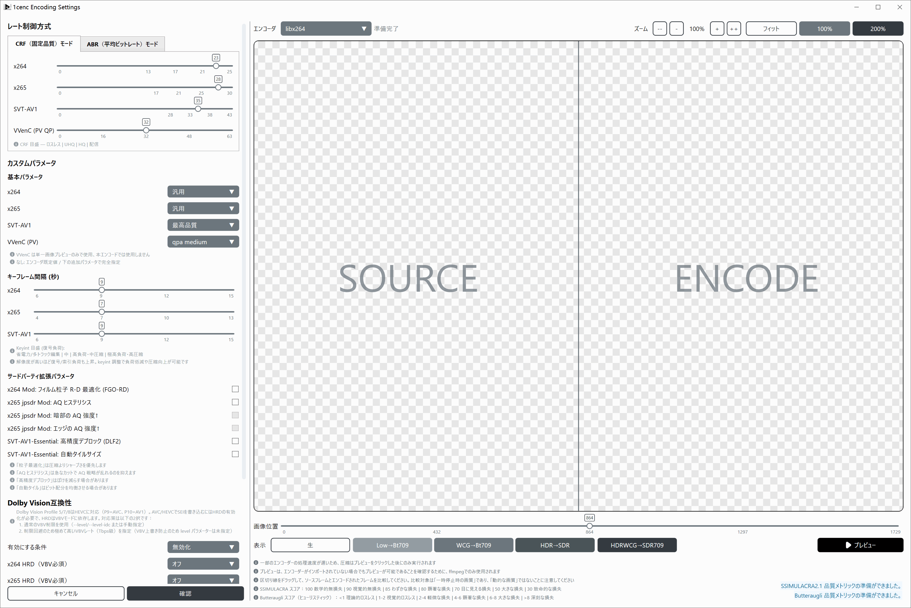

### 2 回目のエンコード — クリップサンプリング

動画の一部を指定してエンコードします。イントロ/アウトロをトリミングしてサンプルテストや品質レビューを行います。

***期間スライダーを使用してセグメントを 60 秒に拡張し、タイムラインの黄色い部分を先頭にドラッグして、「サンプリング開始」をクリックしてみます。***

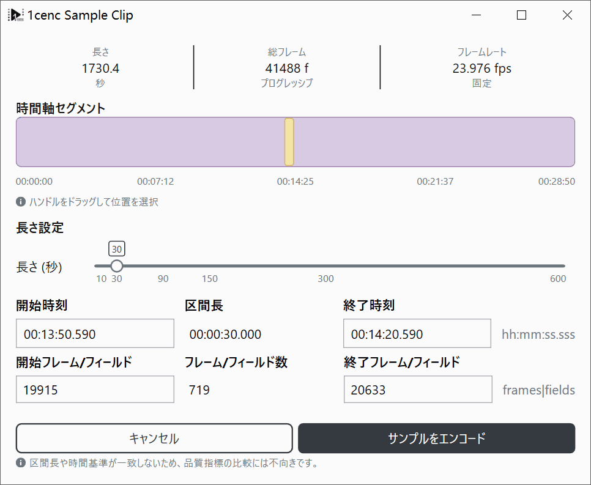

「サンプリング開始」を確認すると、デバッグウィンドウがポップアップ表示されますが、今回はマルチプレクスコマンドは表示されません。

***確認をクリックしてエンコードを開始します。***

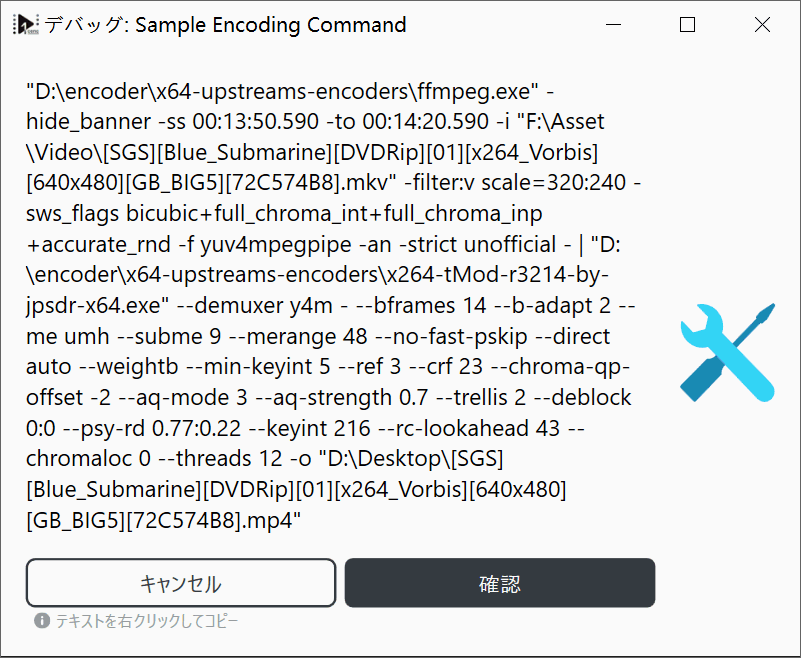

---

## 基本ワークフローチュートリアル完了

### 記載されていない内容（高度なユースケース）

- Blu-ray チャプターインポート
- 動画ソースキューモード
- 動画ソース連結モード
- 動画ソースリパートモード（基本分割、複数 MPLS リパート、結合 BD リパート）
- 基本的な AviSynth および VapourSynth フィルター処理と、キュー、連結、リパートモードのバリエーション
- マルチ NUMA ノードのマルチインスタンス戦略（タイトル PID 番号、ソースフォルダ分割、キュー分割）