# Базовое руководство по работе с 1cenc

Данный документ предназначен для начинающих и описывает полный процесс от загрузки до кодирования видео. Инструкции даны максимально подробно, советы по повышению производительности намеренно опущены.

## Как сообщить о проблемах

Сообщать о проблемах можно через [GitHub Issues](https://github.com/iAvoe/OneColumnEncoder/issues) или в [разделе комментариев NazoRip](https://nazorip.site/archives/1593/). Перед отправкой убедитесь, что проблема действительно вызвана 1cenc. Желательно приложить скриншоты, копии логов выполнения, логи ffprobe и другую вспомогательную информацию для облегчения диагностики.

## Загрузка и «установка»

Для работы 1cenc требуется как минимум Windows 10 версии 1607; рекомендуется версия 1809 / 21H2 (LTSC) или новее.
- 64-разрядная ОС: скачайте `1cenc-win-x64.7z`
- 32-разрядная ОС: скачайте `1cenc-win-x86.7z`
- 32-разрядная версия не рекомендуется для обычного использования

> Некоторые входящие в комплект инструменты не имеют 32-разрядных версий, поэтому часть функций будет недоступна.

### Загрузка и «установка» — список распакованных файлов

- Папка `1cenc`: встроенные инструменты, данные списка очереди, логи кодирования, настройки и прочие данные
- `OneColumnEncoder.exe`: основной исполняемый файл
- `OneColumnEncoder.pdb`: отладочная информация (прикладывайте при сообщении об ошибках)
- `x64-upstreams-encoders.7z`: архив с инструментами обработки видео, такими как FFmpeg, FFprobe, x264, ...
    - Эти инструменты слишком велики (превышают лимиты GitHub) и требуют отдельной распаковки
    - Для 32-разрядной ОС используйте `x86-upstreams-encoders.7z`

**Входящие в комплект инструменты обработки видео**
- `ffmpeg.exe`: декодирование видео, фильтры ffmpeg, предпросмотр кадров при кодировании, предпросмотр разделения в режиме Repart, автоматический мультиплексинг
- `ffprobe.exe`: анализ источника (генерирует часть параметров кодера, проверяет совместимость форматов и целостность)
- `x264[...].exe`: видеокодер AVC
- `x265[...].exe`: видеокодер HEVC
- `SvtAv1EncApp[...].exe`: видеокодер AV1

> Полный комплект 1cenc со всеми инструментами занимает более 350 МБ, в основном из‑за FFmpeg и встроенной зависимости .NET 9.0. Для лёгкой установки можно попросить ИИ помочь вам скомпилировать из исходников.
> Подробное описание инструментов см. в руководстве по загрузке инструментов кодирования: [NazoRip](https://nazorip.site/archives/1482); [GitHub](https://github.com/iAvoe/encoding-tools-download-tutorial)

**Другие инструменты**
- `x64-AVS-VS-plugins`: видеофильтры AviSynth и VapourSynth (требуется установка и импорт AviSynth и VapourSynth)
- `x64-CloudinarySSIMULACRA2.1|GoogleButteraugli`: инструменты оценки качества изображения для предпросмотра влияния параметров кодирования в реальном времени

#### Размещение инструментов обработки видео

Исполняемые файлы `.exe` можно поместить куда угодно, но 1cenc автоматически импортирует их из следующих мест:

>     .
>     ├── ①
>     ├── OneColumnEncoder.exe
>     ├── OneColumnEncoder.pdb
>     ├── x64-upstreams-encoders
>     │    └── ②
>     └── 1cenc
>          ├── ③
>          ├── x64-upstreams-encoders
>          │   └── ④
>          ├── x64-AVS-VS-plugins
>          │   └── ...
>          ├── x64-CloudinarySSIMULACRA2.1
>          │   └── ...
>          └── x64-GoogleButteraugli
>             └── ...
>

---

## Первый запуск

Дважды щёлкните `1cenc.exe`, чтобы открыть. При первом запуске появится запрос на автоматический импорт — нажмите «Подтвердить»:

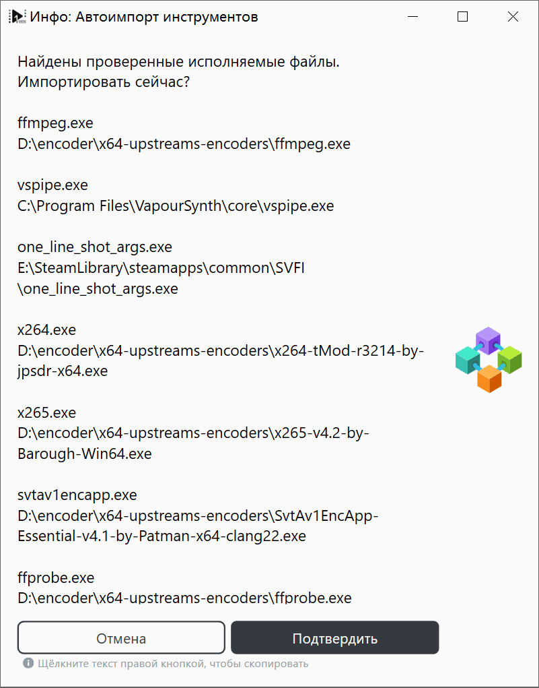

Если вы пропустили это, можно выполнить импорт вручную или включить опцию «Запускать автоматический импорт при следующем открытии» в настройках.

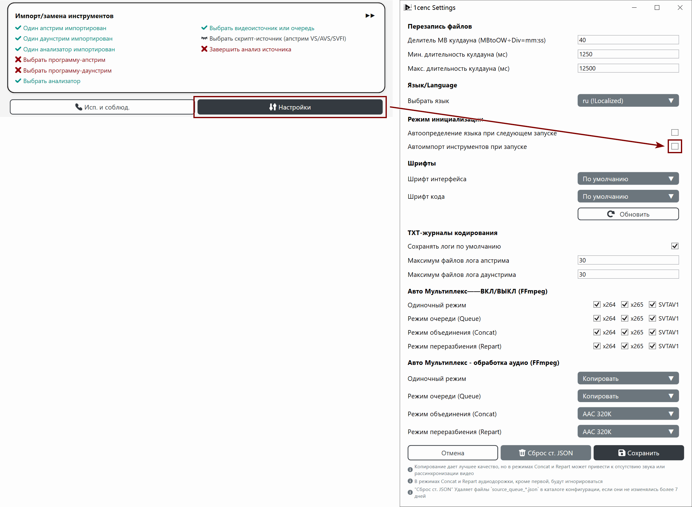

> Если вы хотите запускать 1cenc.exe из другого места, создайте ярлык или запись в меню «Пуск».

Автоматический поиск 1cenc также попытается найти установленные в системе VapourSynth и SVFI. На изображении ниже показан результат автоматического импорта, который одновременно обнаружил 4 распакованных инструмента и 2 установленных.

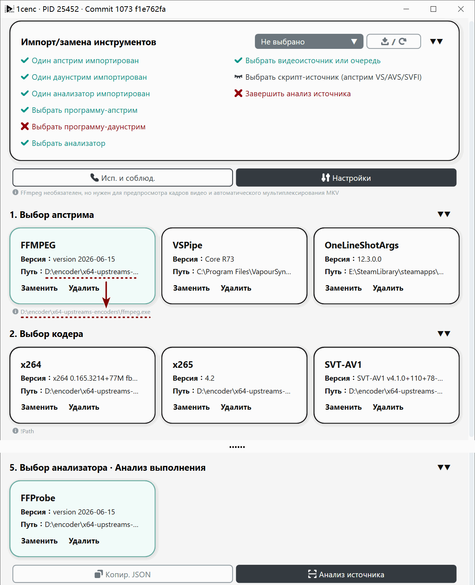

### Первый запуск — обзор главного интерфейса

Главный интерфейс состоит из **заголовков**, **контрольного списка**, **карточек элементов** и **кнопок**. Карточки инструментов в зависимости от функции либо выбирают элемент, либо открывают окно.

#### Карточки инструментов

Строительные блоки интерфейса: чёрная рамка, чёрный текст, светло-серый фон. Поддерживают свёртывание, подсветку при наведении, выделение и состояние ошибки.
- После привыкания свёрнутый вид делает интерфейс проще.
- Если карточка инструмента отображает аномальное состояние (красная рамка), выполните повторный импорт инструмента.

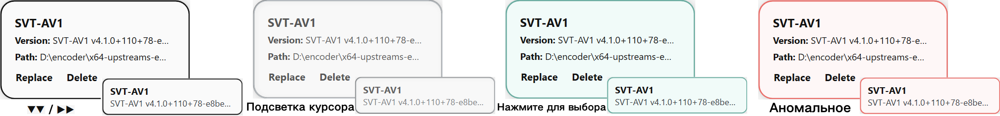

Для длинных путей карточки инструментов предоставляют два способа отображения:
- всплывающая подсказка при наведении;
- подсказка внизу при выделении.

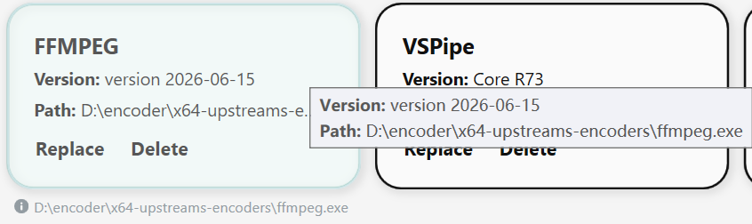

#### Заголовки и кнопки

**Заголовки** показывают последовательность шагов и инструкции, включая кнопку развёртывания/свёртывания справа.

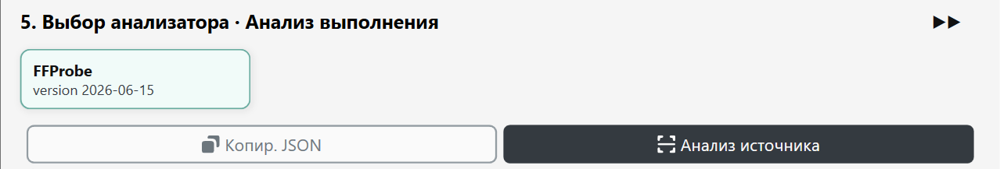

**Кнопки** выполняют действия или открывают окна, автоматически блокируясь, если не выполнены необходимые условия.

> Примечание: пункт «3. Выберите файл зависимости» относится к зависимости AvsToPipeMod (AviSynth.dll) и его можно игнорировать.

#### Контрольный список

Проверяет выбор инструментов, условия разблокировки кодирования и возможные проблемы источника видео.
- Контрольный список также поддерживает свёртывание.
- Щёлкните по элементу списка, чтобы увидеть подробности.

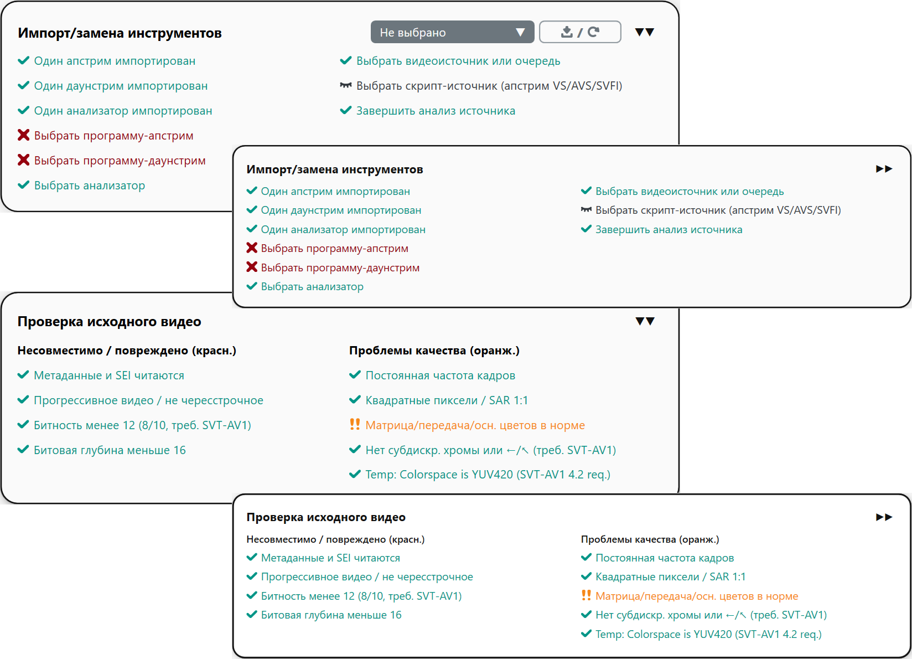

**4 состояния элемента контрольного списка:**
- **Не проверено** — чёрный текст, значок закрытого глаза: элемент не относится к текущему процессу и пропускается.
- **Пройдено** — зелёный текст, значок галочки: нормально или условия выполнены.
- **Предупреждение** — жёлтый текст, значок двойного восклицания: может привести к аномальным результатам кодирования, но кнопка «Начать кодирование» не блокируется.
- **Ошибка** — красный текст, значок крестика: базовые условия не выполнены, кодирование невозможно; кнопка «Начать кодирование» блокируется.

#### Карточка источника видео и карточка конфигурации кодирования

Эти карточки визуально отличаются от стандартного белого фона из‑за своих особых функций. Карточка источника обычно открывает окно выбора файла при щелчке; карточка конфигурации обычно открывает окно настроек.

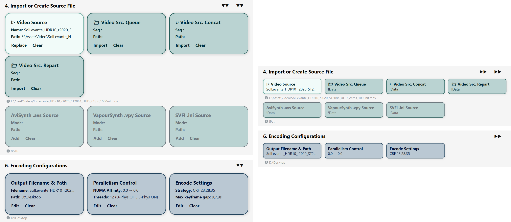

**Функции карточки источника видео:**
- **Видеоисточник**: выбор одного файла.
- **Очередь видео**: выбор нескольких файлов или папки PLAYLIST Blu-ray.
- **Конкатенация видео**: выбор нескольких файлов для объединения в один.
- **Репартиция видео**: выбор папки с несколькими источниками или папки PLAYLIST Blu-ray, указание точек разделения, вывод нескольких разделённых или объединённых и затем разделённых видео (можно понимать как нарезку).

---

### Первый запуск — обзор настроек

Страница настроек открывается медленнее всего из‑за загрузки настроек шрифтов.

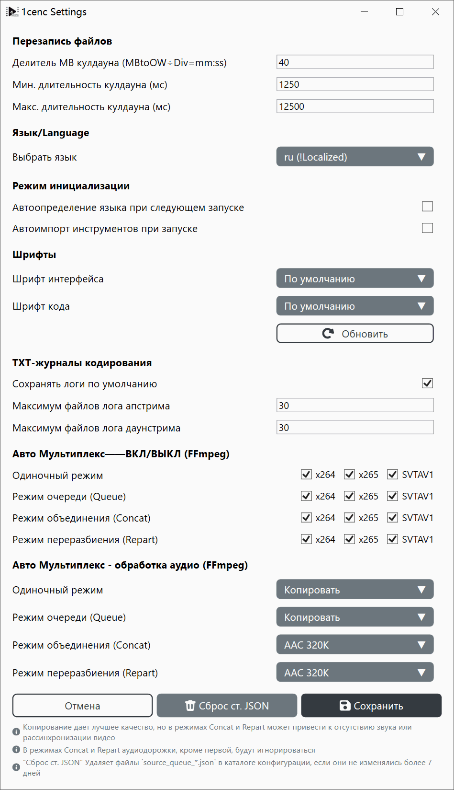

#### Значения по умолчанию и рекомендуемые параметры

**Обработка перезаписи — делитель МБ для охлаждения**
- Вычисляет время задержки перед перезаписью на основе размера файла.
- Рекомендуется оставить по умолчанию, чтобы предотвратить случайную перезапись больших файлов; минимум — 1.

**Текстовые логи кодирования**
- Сохраняет логи выполнения программ верхнего уровня (FFmpeg, VapourSynth) и нижнего уровня (x264, x265, SVT-AV1) в файлы.
- Рекомендуется включить для диагностики; количество файлов по умолчанию основано на типичном числе серий в сериале (длина очереди).

**Автоматический мультиплексинг**
- Помещает закодированные видеопотоки в контейнер `.mkv`.
- Так как x265 не имеет этой функции (выдаёт только `.hevc`) и может не сохранять метаданные частоты кадров без указания параметров, рекомендуется включить для x265.
- x264 упаковывает в `.mp4`, SVT-AV1 — в лёгкий `.ivf`; эти форматы имеют ограничения по совместимости с аудио, поэтому отключение автоматического мультиплексинга также отключает механизм обработки аудио.

**Автоматический мультиплексинг — обработка аудио**
- Из‑за хорошей совместимости `.mkv` и поддержки в Adobe-редакторах, для **одиночного файла** и **режима очереди** по умолчанию используется копирование аудиопотока (наилучшее качество и максимальная скорость).
- В **режиме конкатенации** и **режиме репартиции** требуется редактирование аудиопотоков; некоторые форматы могут не поддерживаться или поддерживаться ограниченно, поэтому по умолчанию установлена перекодировка.
- Хотя в перекодировке есть опция Opus, по умолчанию выбран AAC из‑за более широкой совместимости.

---

## Первое кодирование

1. Выберите FFmpeg.
2. Выберите x264.
3. Выберите видеоисточник.
    - 1cenc автоматически анализирует новый источник, в противном случае нажмите «Запустить анализ видеоисточника».
    - FFProbe выбирается автоматически, вручную выбирать не нужно.
4. Нажмите «Начать кодирование».
    - Вы также можете нажать «Имя выходного файла и путь», чтобы изменить место сохранения.

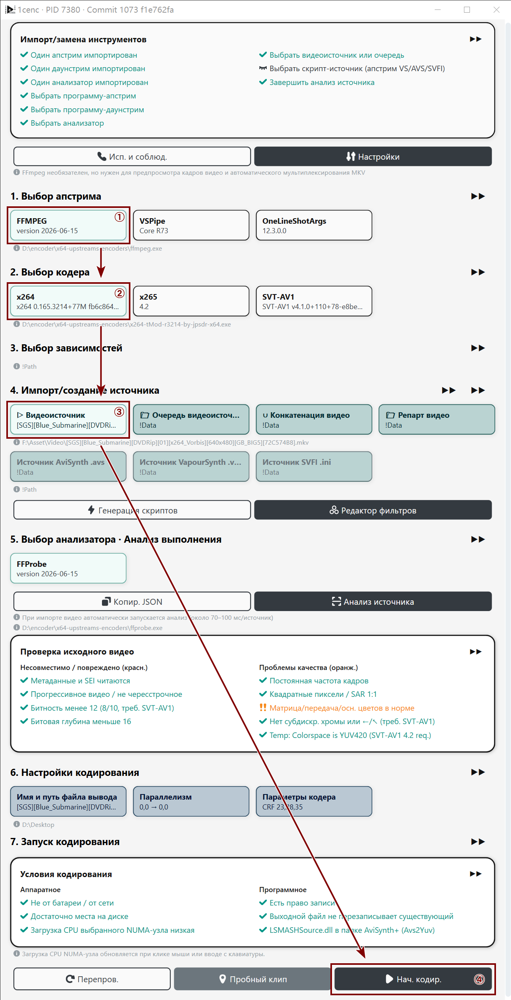

После нажатия «Начать кодирование» открывается диалог с параметрами, поддерживающий копирование текста правой кнопкой мыши.
- На изображении показана двухэтапная структура: **Кодирование** → **Мультиплексирование**.
    - т.е. «**Кодирование видео** → **Копирование или кодирование аудио + мультиплексирование**».
- В **режиме конкатенации** и **режиме репартиции** при установке обработки аудио на «Перекодировать в AAC/Opus» команда кодирования становится трёхэтапной:
    - «**Кодирование видео** → **Кодирование аудио** → **Мультиплексирование**».
- Наличие параметров типа `--master-display` означает, что HDR-метаданные были распознаны и преобразованы.

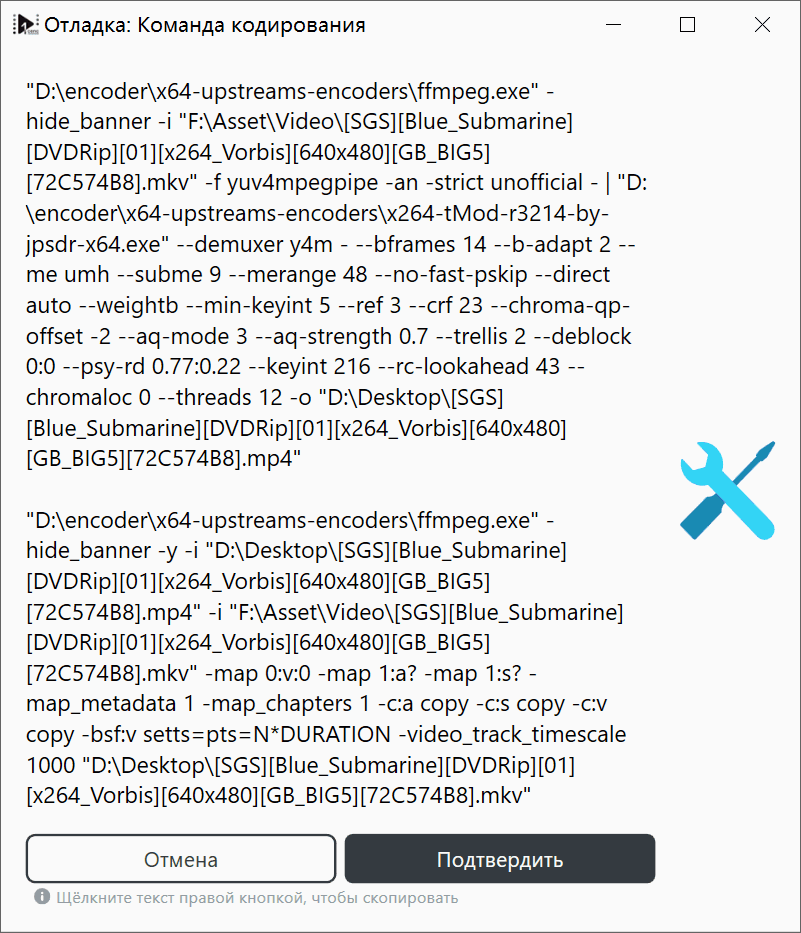

После подтверждения главное окно скрывается для экономии памяти и открывается **Монитор кодирования**:

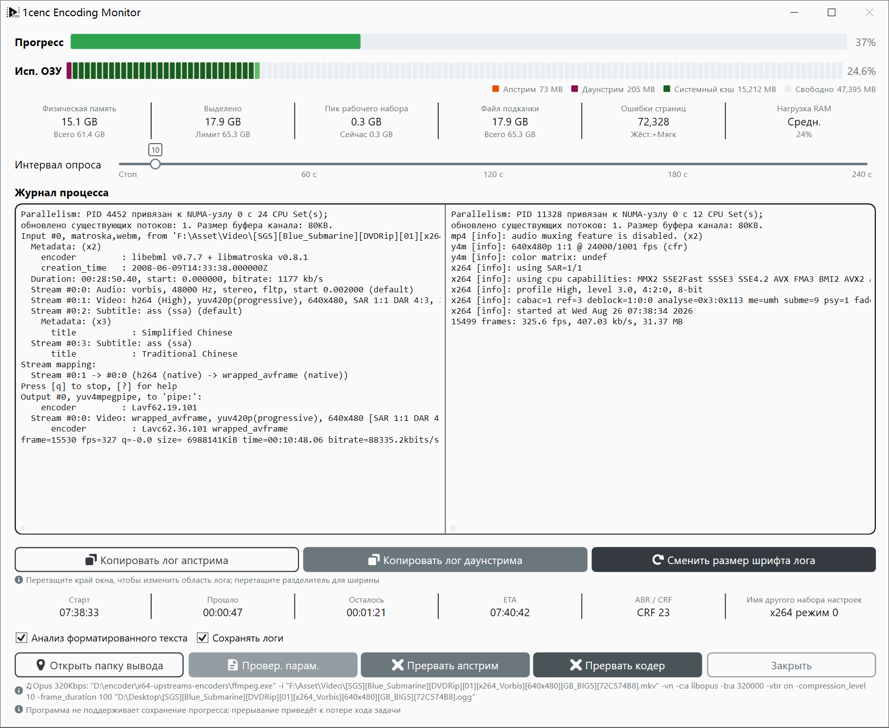

### Первое кодирование — обзор монитора кодирования

**Индикатор выполнения**
- Отображает прогресс, если известно общее число кадров; в противном случае показывает анимацию «парикмахерский столб».

**Использование памяти**
- Отслеживает узкие места по памяти.
- Проверьте, не стоит ли закрыть некоторые программы для освобождения памяти.
- Если компьютер имеет несколько узлов NUMA, теоретически можно запустить несколько процессов кодирования.

**Логи процессов**
- Слева: логи программ верхнего уровня (FFmpeg, VapourSynth).
- Справа: логи кодера нижнего уровня.
- Разделитель между ними можно перетаскивать для изменения размера окон.
- Три кнопки внизу позволяют скопировать текущий текст лога или циклически менять размер шрифта.

**Калькулятор времени**
- Отображает затраченное время, предполагаемое время завершения и другие временные статусы.
- Если в метаданных видео отсутствует общее число кадров, оценочное время не обновляется.

**Разбор форматированного текста**
- Распознаёт управляющие символы шрифтов, цветов и т.д. (используется SVT-AV1).

**Сохранение лога**
- Сохраняет логи процессов текущего сеанса кодирования в файл `.txt` в каталоге `1cenc`.

**Обзор и операции с процессами**
- **Прервать программу верхнего/нижнего уровня**
    - Программа верхнего уровня отвечает за декодирование, поэтому она обрабатывает больше кадров, чем кодер.
    - Выбор зависит от того, хотите ли вы закодировать ещё несколько кадров (прервать верхний уровень) или полностью остановить (прервать нижний).
- **Закрыть**
    - Разблокируется после прерывания/завершения обеих программ.

После завершения кодирования 1cenc запускает автоматическое мультиплексирование, что создаёт второй сегмент лога программы верхнего уровня:

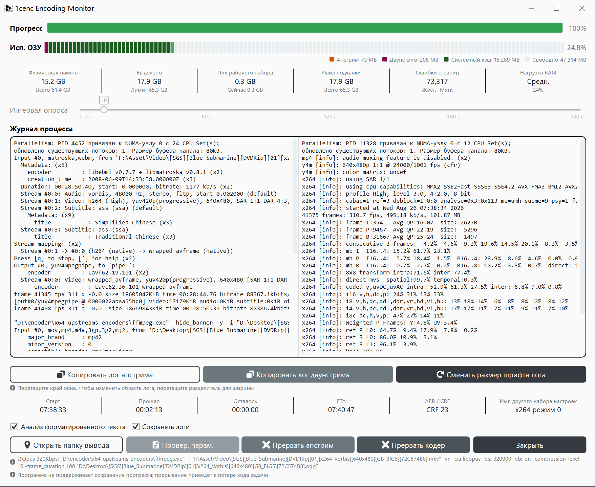

---

## Второе кодирование (полный процесс)

***Следуйте порядку настройки / кликов, показанному на изображении ниже, чтобы повторить кодирование:***

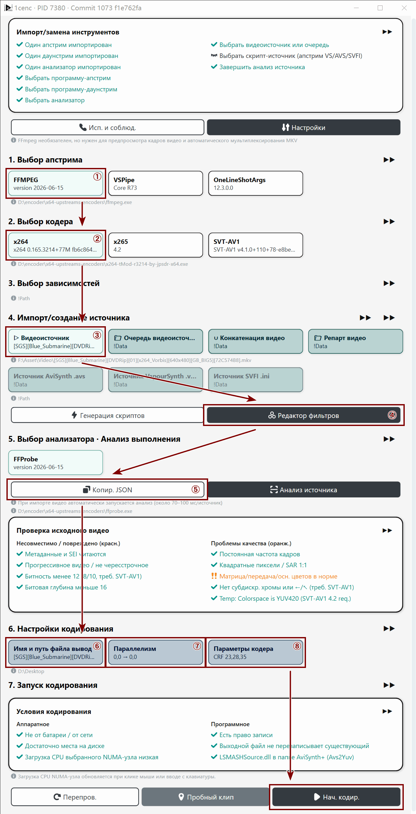

### Второе кодирование ④ — обзор редактора фильтров

Кнопки редактора фильтров разблокируются после завершения анализа, поскольку некоторые строки зависят от данных источника.
- Редактор фильтров автоматически выбирает нужную вкладку (здесь программа верхнего уровня — ffmpeg).

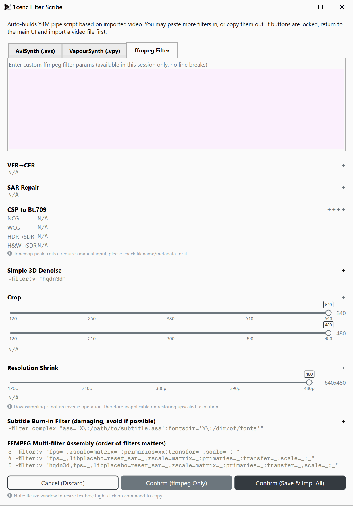

Параметры отображаются как «N/A», если они не нужны; для переменной частоты кадров или не-квадратных пикселей они генерируются автоматически.

***Следуя изображению ниже, создайте команду уменьшения разрешения с помощью элементов управления масштабированием, вставьте её в поле параметров фильтра вверху и нажмите «Подтвердить».***

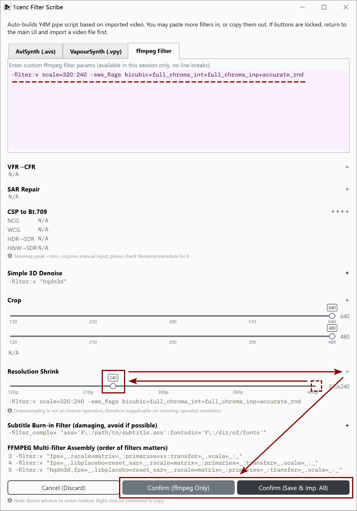

При сохранении появится диалог подтверждения «Перезаписать ffprobe JSON». Это происходит потому, что изменение разрешения требует пересчёта параметров кодирования.

***Нажмите «Обновить ffprobe JSON».***

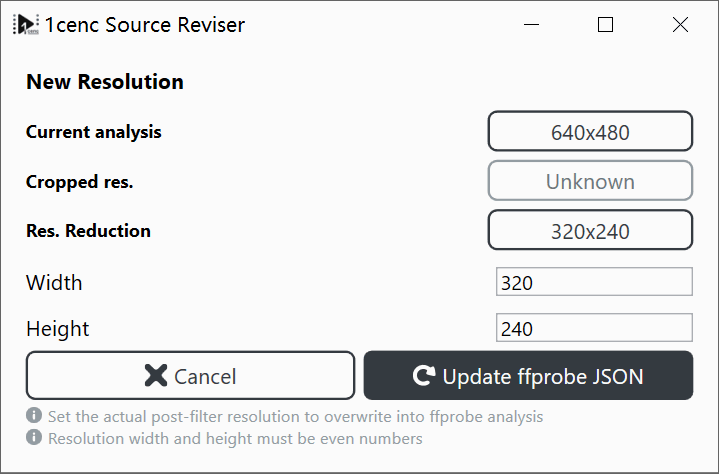

> Примечание: редактор фильтров VapourSynth поддерживает предпросмотр эффекта фильтра для одного кадра.

### Второе кодирование ⑤ — копирование сырого JSON

Если 1cenc выдаёт странные суждения в контрольном списке или неожиданные предупреждения, используйте эту функцию для диагностики.

***(Необязательно) Откройте ваш текстовый редактор, вставьте содержимое и изучите.***

### Второе кодирование ⑥ — имя выходного файла и путь

Позволяет увидеть, как имя файла будет отображаться при различной ширине интерфейса, помогает избежать ошибок кодирования и упрощает управление большим количеством файлов.

Здесь можно задать новое имя файла и указать новое место сохранения.

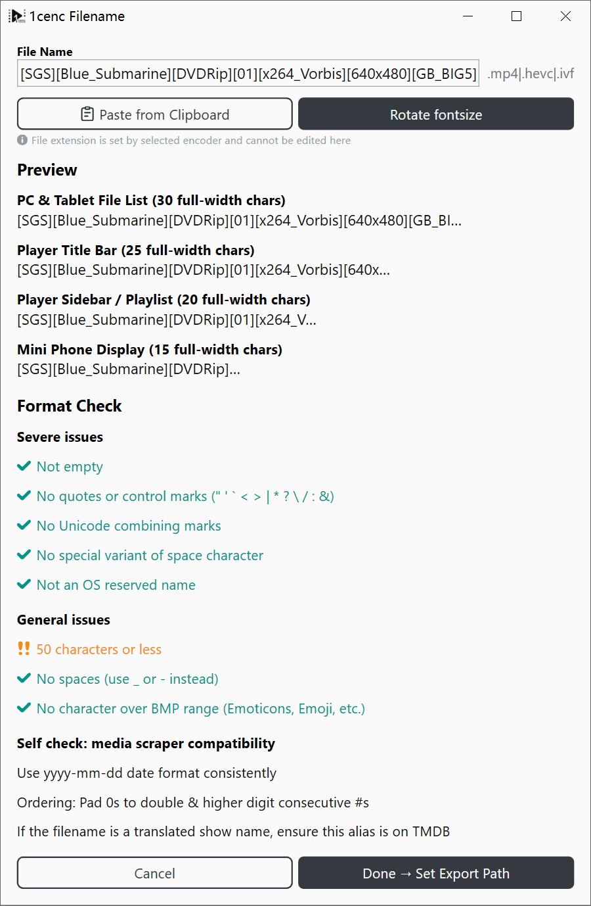

### Второе кодирование ⑦ — планирование параллельных вычислений

Настройка привязки программ верхнего и нижнего уровня к конкретным узлам NUMA для многопроцессорных систем или нестандартных настроек BIOS.

**Ограничить количество потоков программ верхнего/нижнего уровня числом физических ядер**
- Кодеры обычно требуют много вычислений и мало кэшируют.
    - Ограничение физическими ядрами даёт ускорение в стиле HPC без потери преимуществ гиперпоточности.
- Это делает 1cenc быстрее и стабильнее, чем обычные кодеры.

**Буфер канала (pipe buffer)**
- Теоретически увеличивает использование кэша; на практике влияние незначительно, можно игнорировать.

***Можно оставить значения по умолчанию или отметить все пункты, затем подтвердить.***

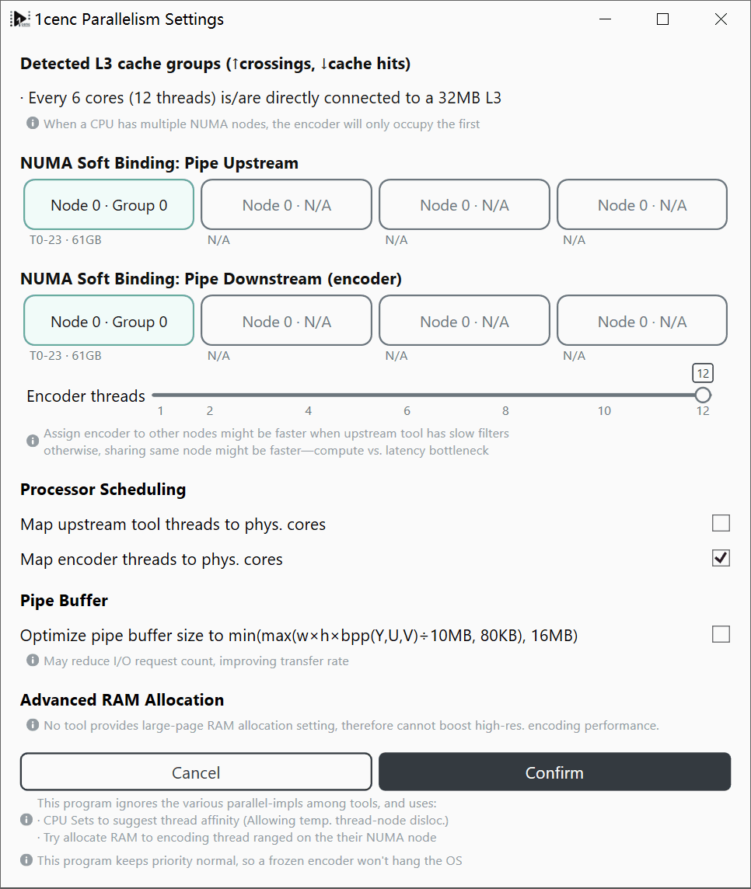

### Второе кодирование ⑧ — параметры кодирования (и предпросмотр)

Здесь настраиваются параметры кодера / программы нижнего уровня и выполняется предпросмотр:
1. Выберите значение CRF, руководствуясь подсказкой **Шкала CRF**.
2. В разделе **Пользовательские параметры — Базовые параметры** выберите пресет, наиболее соответствующий источнику.
3. В разделе **Пользовательские параметры — Интервал ключевых кадров (сек)** задайте значение, подходящее для предполагаемого воспроизведения.
4. (Остальные параметры игнорируйте.)
5. Нажмите **Предпросмотр** в правом окне и подождите завершения.
    1. Дождитесь завершения кодирования текущего кадра.
    2. (Необязательно) Дождитесь завершения расчёта оценок качества SSIMULACRA и Butteraugli (синий текст внизу справа).
6. Перетащите разделитель между SOURCE и ENCODE для точного сравнения.
7. (Необязательно) Перетащите ползунок **Позиция кадра** для повторного просмотра.
8. (Необязательно) Смените **кодек** в левом верхнем углу окна предпросмотра и повторите просмотр.

***После настройки параметров CRF, выбора базовых параметров и интервала ключевых кадров нажмите «Подтвердить» внизу левой панели.***

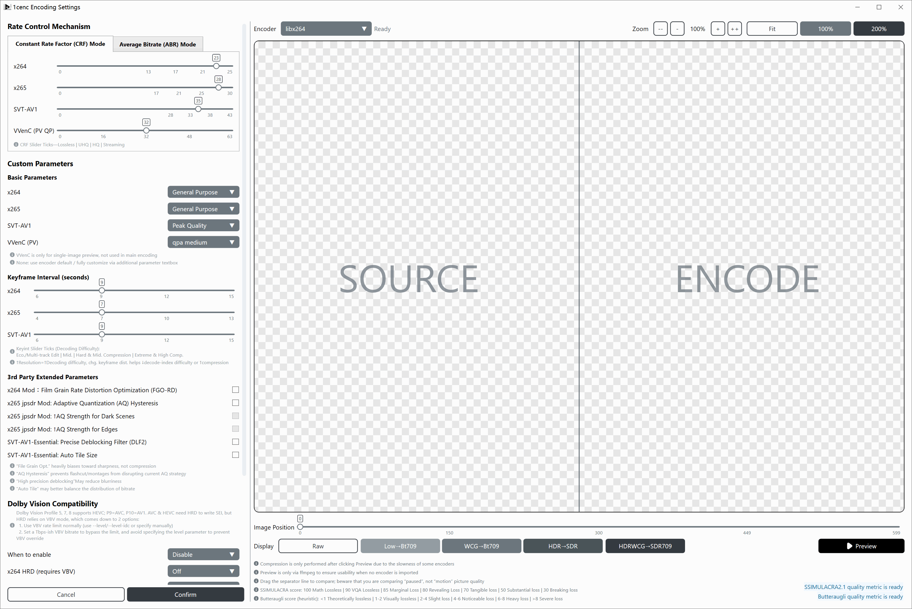

### Второе кодирование — выборка фрагмента

Позволяет задать для кодирования только часть видео. Удаляет вступления/концовки для тестовых образцов и проверки качества.

***Попробуйте расширить фрагмент до 60 секунд с помощью ползунка длительности, перетащите жёлтую область на временной шкале к началу и нажмите «Начать выборку».***

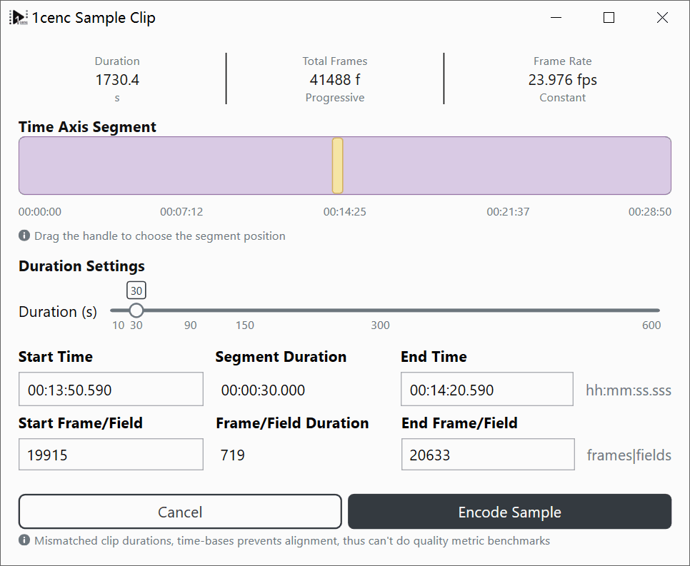

После подтверждения «Начать выборку» появится отладочное окно, но на этот раз команда мультиплексирования не отобразится.

***Нажмите «Подтвердить», чтобы начать кодирование.***

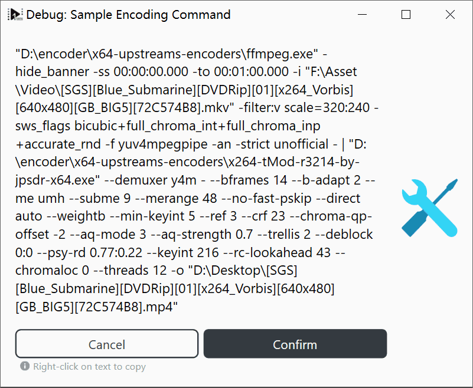

---

## Базовое руководство завершено

### Неупомянутые возможности (продвинутые сценарии)

- Импорт глав Blu-ray
- Режим очереди видеоисточников
- Режим конкатенации видеоисточников
- Режим репартиции видеоисточников (базовое разделение, репартиция многодорожных BD, репартиция объединённых BD)
- Базовая обработка фильтрами AviSynth и VapourSynth с вариациями для очереди, конкатенации и репартиции
- Многопроцессные стратегии для нескольких узлов NUMA (номер PID заголовка, разбивка исходной папки, разбивка очереди)