# 1cenc 基本流程使用教學

本文件面向入門群體，用於說明從下載到開始壓製影片的完整流程順序；本文的操作流程會寫的偏詳細，且會忽略可能與壓制性能相關的使用建議。

## 如何回饋問題

通過 [GitHub Issues](https://github.com/iAvoe/OneColumnEncoder/issues) 或 [NazoRip 項目評論區](https://nazorip.site/archives/1593/) 可以回饋。回饋前請確認問題著實歸咎於 1cenc，最好有截圖、運行日誌拷貝、ffprobe 日誌之類的輔助資訊，以便排查。

## 下載與“安裝”

運行 1cenc 需要至少 Windows 10 系統，建議 1809 / 21H2（LTSC）或更高版本，最低 1607
- 64bit 操作系統下載 `1cenc-win-x64.7z`
- 32bit 操作系統下載 `1cenc-win-x86.7z`
- 不推薦在缺少折騰意願的情況下使用 32bit 版本

> 主流操作系統皆為 64bit，並且部分集成的工具不支持 32bit 操作系統，因此儘管能跑，但功能有缺

### 下載與“安裝”——解壓文件列表

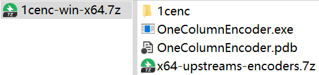

- `1cenc` 文件夾：集成的工具、隊列列表數據、壓制運行日誌、設置等數據
- `OneColumnEncoder.exe`：主程式
- `OneColumnEncoder.pdb`：崩潰除錯資訊（回饋問題時上傳）
- `x64-upstreams-encoders.7z`：ffmpeg、ffprobe、x264 等**影像處理工具**的壓縮包
    - 這些工具體積太大（觸發 GitHub 限制），因此需要額外進行解壓
    - 32bit 操作系統則為 `x86-upstreams-encoders.7z`

**集成的影像處理工具**
- `ffmpeg.exe`：負責影片解碼、ffmpeg 濾鏡、影片幀壓製預覽、重分集分界預覽、自動封裝
- `ffprobe.exe`：負責分析影片源（生成部分編碼器參數、檢查格式相容性以及是否損壞）
- `x264[...].exe`：AVC 影片編碼器
- `x265[...].exe`：HEVC 影片編碼器
- `SvtAv1EncApp[...].exe`：AV1 影片編碼器

> 附帶所有工具的 1cenc 會超過 350MB，主因是 FFmpeg 和內建 .net 9.0 的依賴所增，輕量安裝可詢問 AI 來“自行”編譯
> 工具詳細說明見影片壓製相關工具下載教學：[NazoRip](https://nazorip.site/archives/1482)；[GitHub](https://github.com/iAvoe/encoding-tools-download-tutorial)

**其它工具**
- `x64-AVS-VS-plugins`：AviSynth、VapourSynth 影片濾鏡（需安裝和導入 AviSynth、VapourSynth）
- `x64-CloudinarySSIMULACRA2.1|GoogleButteraugli`：集成的圖像畫質跑分工具，用於預覽影片壓製參數設置的影響

#### 影像處理工具放置

`x86|x64-upstreams-encoders.7z` 中的 .exe 工具可以放在任意位置，但 1cenc 擁有自動導入功能，且會搜索以下範圍，讓後續的導入操作更輕鬆：

>     .
>     ├── ①
>     ├── OneColumnEncoder.exe
>     ├── OneColumnEncoder.pdb
>     ├── x64-upstreams-encoders
>     │    └── ②
>     └── 1cenc
>          ├── ③
>          ├── x64-upstreams-encoders
>          │   └── ④
>          ├── x64-AVS-VS-plugins
>          │   └── ...
>          ├── x64-CloudinarySSIMULACRA2.1
>          │   └── ...
>          └── x64-GoogleButteraugli
>             └── ...
>

---

## 首次啟動

雙擊 `1cenc.exe` 以打開。首次啟動會詢問是否自動導入，點擊確認導入：

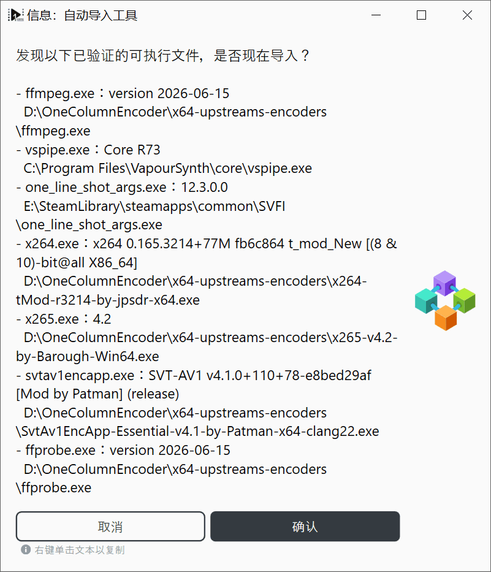

若點錯或遺漏，則可以手動導入，或在設置界面勾選“下次打開時運行自動導入”

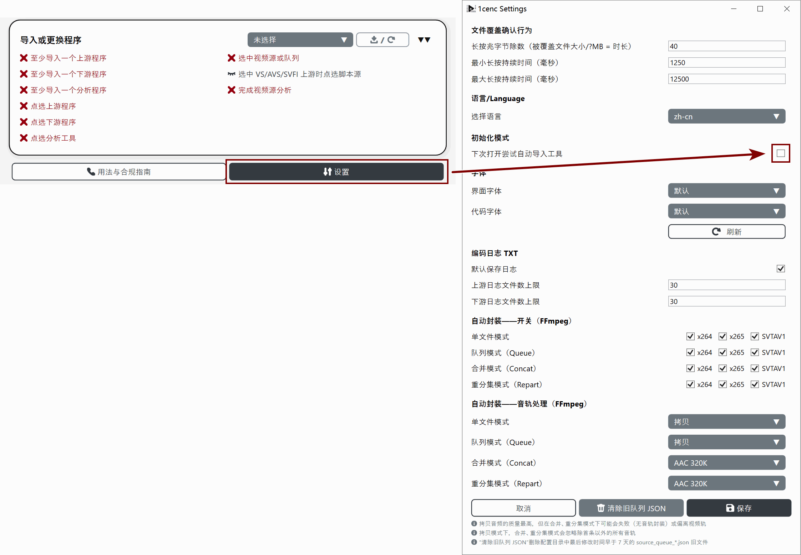

> 若希望在別處也能打開，可以創建捷徑或開始選單項。

由於 VapourSynth 和 SVFI 是安裝到系統的軟體，因此 1cenc 的自動導入搜索會嘗試找出它們並導入。下圖中顯示了自動導入將 4 個解壓出的工具，以及 2 個已安裝的工具同時導入的樣式。

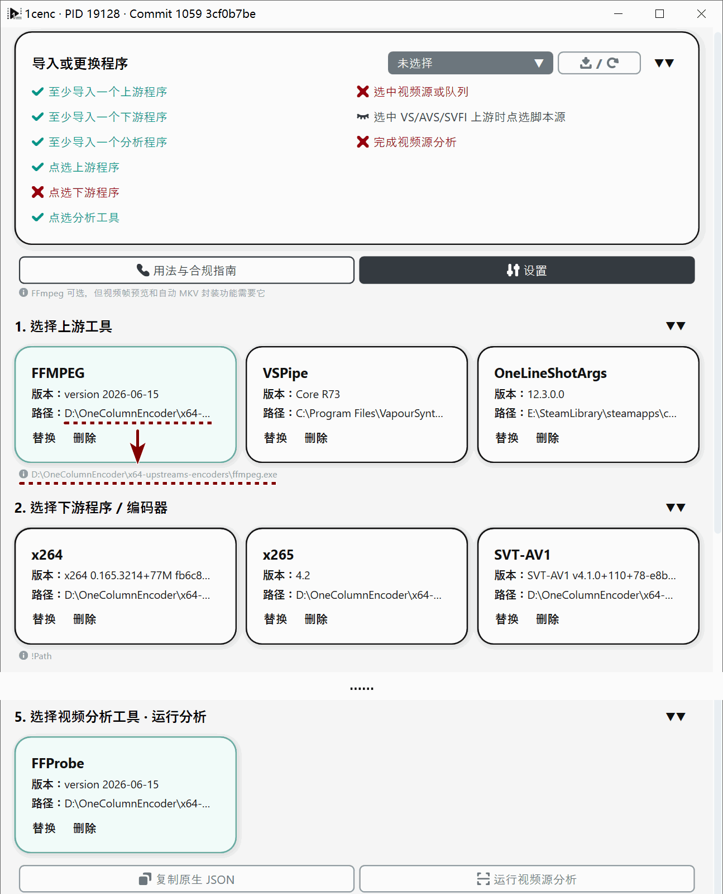

### 首次啟動——主界面一覽

1cenc 的主界面主要由**標題**、**檢查列表**、**卡片**和**按鈕**組成。其中工具卡片根據功能不同，點擊後可能會選中或打開窗口。

#### 工具卡片

主界面的主要組成部分。由黑框、黑字和淺灰背景組成。擁有展開/摺疊、懸浮高亮、選中和異常狀態顯示。熟悉操作後，摺疊狀態可以讓操作更簡便。
- 若工具狀態異常情況（邊框變紅）出現，則重新導入工具

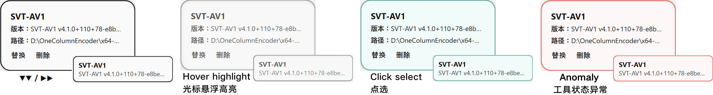

由於“路徑”太長，工具卡片提供了兩種完整路徑顯示功能：
- 游標懸浮一段時間後的工具提示
- 點擊選擇工具卡片後，在下方的提示文本中

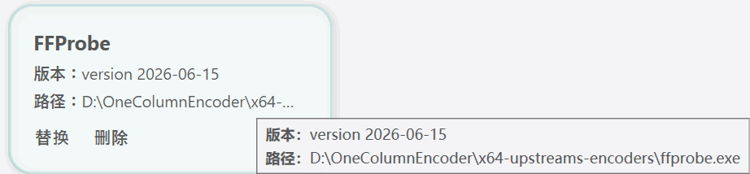

#### 標題、按鈕

**標題**說明了操作步驟順序，步驟說明，以及包含了右側的展開/摺疊按鈕。

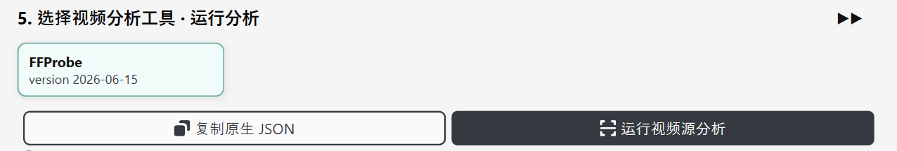

**按鈕**會執行一些操作或打開窗口，但若未滿足運行前提時，按鈕會被禁用

> 其中“3. 選擇依賴文件”用於 AvsToPipeMod 的 AviSynth.dll 依賴，不用則無視

#### 檢查列表

各種檢查項目，包括是否選擇了工具，滿足解鎖“開始壓製”按鈕的條件，影片源可能存在的問題等。
- 檢查列表也有摺疊狀態
- 點擊列表項以查看詳情

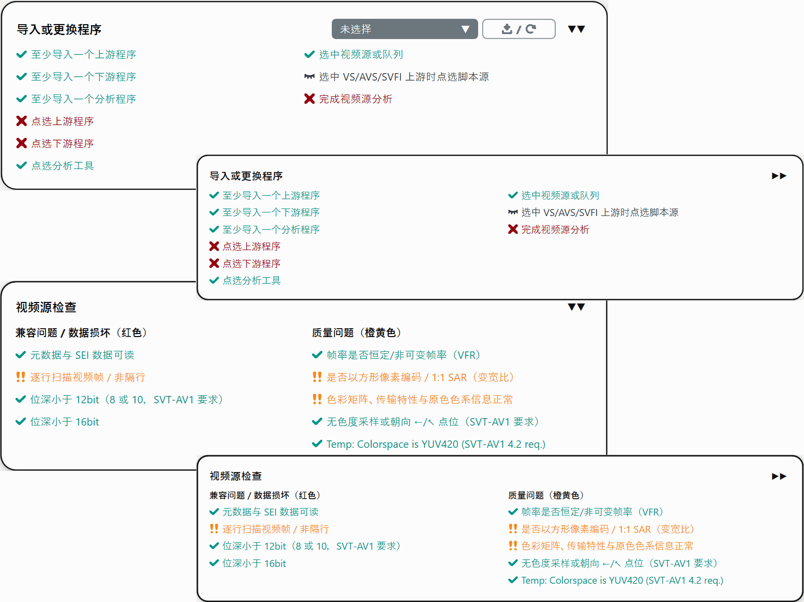

**檢查項的 4 種狀態：**
- 未查——黑字、閉眼圖示：檢查項與當前流程不相關，被忽略
- 通過——綠字、對勾圖示：正常或條件已滿足
- 警告——黃字、雙嘆號圖示：可能會導致壓制結果異常，但不禁用“開始壓制”按鈕
- 錯誤——紅字、打叉圖示：基礎條件不滿足或無法啟動壓制的異常，禁用“開始壓制”按鈕

#### 影片源卡片、壓製配置卡片

這些卡片的功能不同，因此外觀區別於預設的白底黑字。影片源卡片的普遍點擊行為是打開文件選擇窗口；壓制配置卡片的普遍點擊行為是打開配置窗口。

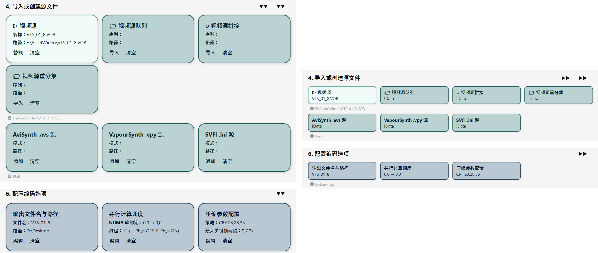

**影片源卡片的功能：**
- **影片源**：選擇一個影片源
- **影片隊列（Queue）**：選擇多個影片源或藍光播放列表（PLAYLIST）文件夾
- **影片源拼接（Concat）**：選擇多個影片源，輸出一個拼接後的影片
- **影片源重分集（Repart）**：選擇影片源文件夾（多個影片源）或藍光播放列表（PLAYLIST）文件夾，指定分割線位置，輸出多個切分或合併後切分的影片（可以簡單視為切分）

---

### 首次啟動——設置一覽

設置頁是 1cenc 中打開最慢的窗口——因為字體設置的載入所致。

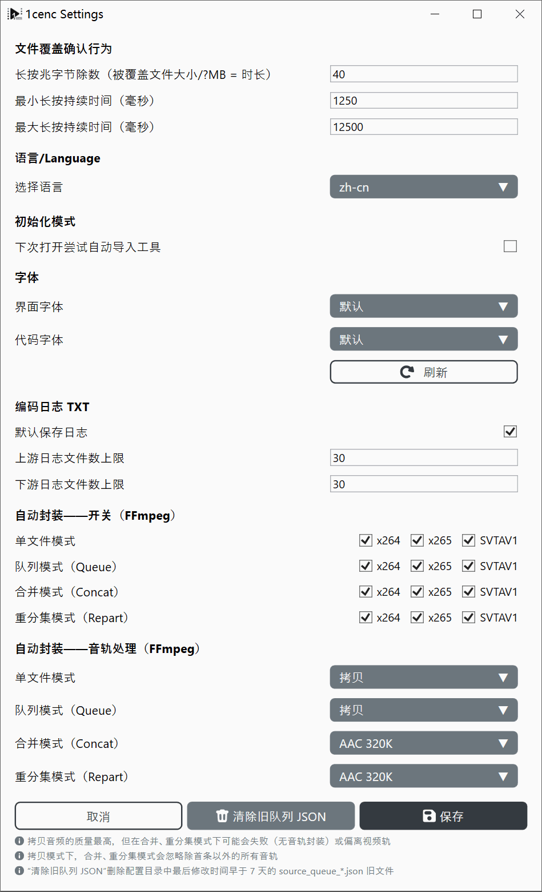

#### 默認與建議值

**文件覆蓋確認——冷卻百萬位元組除數**
- 當檢測到將被覆蓋掉的文件時，根據將被覆蓋文件的大小來算冷卻時長
- 建議保持默認，防止大文件被輕易覆蓋，最小值為 1

**編碼日誌 TXT**
- 將選擇的上遊程序（ffmpeg、VapourSynth、...）和下遊程序（x264、x265、SVT-AV1）在壓制任務中產生的運行日誌（Runtime log）保存到文件
- 建議開啟以便排查，文件數量上限的預設值是根據常見的番劇集數（即隊列長度）而定

**自動封裝開關**
- 將壓製出的影片串流封裝為 `.mkv` 格式
- 由於 x265 不支持自動封裝（只導出 `.hevc`），且會導致幀率等元數據遺失，因此建議為其開啟
- x264 會封裝到 `.mp4` 格式，SVT-AV1 會封裝到輕量的 `.ivf` 格式，這些格式存在音訊相容性限制，因此關閉後會禁用音訊處理機制

**自動封裝——音訊處理**
- 由於 `.mkv` 格式良好的相容性，也被 Adobe 系列剪輯軟體支持，因此**單文件**和**隊列模式**推薦直接拷貝音訊串流到自動封裝結果
- **合併模式**和**重分集模式**涉及音訊串流的剪輯，有的音訊串流可能不支持或支持不良，因此預設值設為重編碼
- 儘管重編碼模式有 Opus 格式支持，但預設值故意設置為 AAC 格式，以求相容

---

## 首次壓制

1. 點選 FFmpeg
2. 點選 x264
3. 選擇一個影片源
    - 每次選擇新影片源時，1cenc 會自動運行影片分析，否則需要點擊“運行影片源分析”按鈕
    - FFProbe 會被自動選中，因此無需手動點選
4. 點擊“開始壓制”
    - 當然，可以考慮點擊“輸出檔案名與路徑”來調整輸出位置

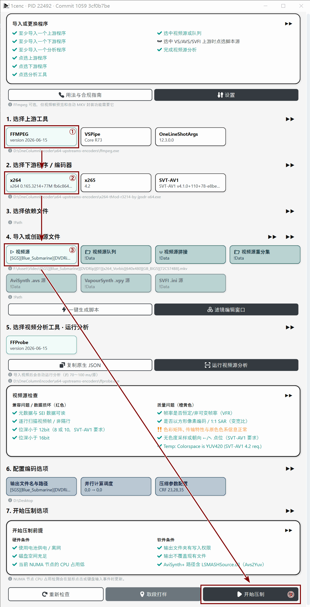

點擊“開始壓制”後，1cenc 會首先彈出一個壓制和封裝參數對話框，該對話框支持右鍵複製文本。
- 圖中是**壓制**→**封裝**的兩段式結構
    - 即“**影片壓製**→**音訊拷貝或壓製 + 封裝**”
- 在**合併模式**、**重分集模式**，並且設置自動封裝音訊處理為“重編碼到 AAC/Opus”時，編碼命令會變成 3 段式結構
    - 即“**影片壓製**→**音訊壓製**→**封裝**”
- 如果看到 `--master-display` 或 `G(xxx,yyy),B(zzz,aaa),R...` 值的參數，則說明源影片的 HDR 元數據附錄/側數據（sidedata）已經被識別和轉換到壓制參數

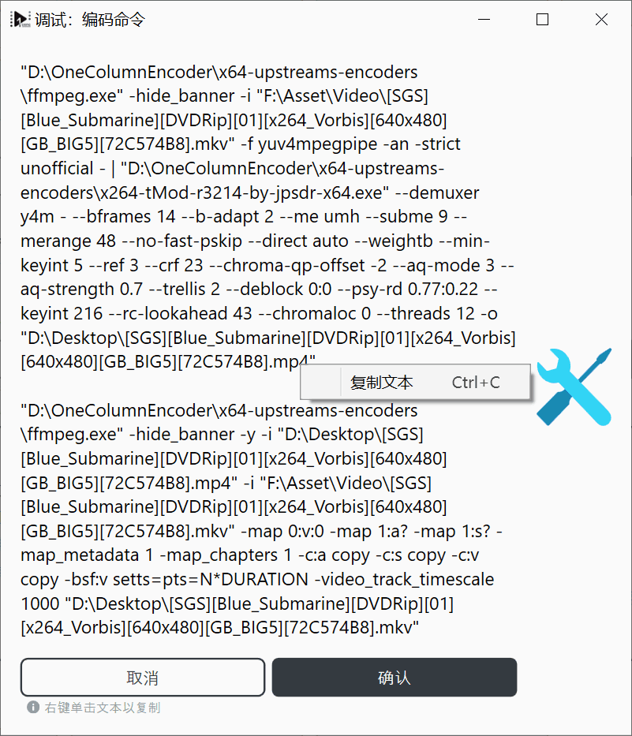

再次點擊確認後，主界面會隱藏以釋放記憶體和減少背景干擾，**壓制監視器**窗口會打開：

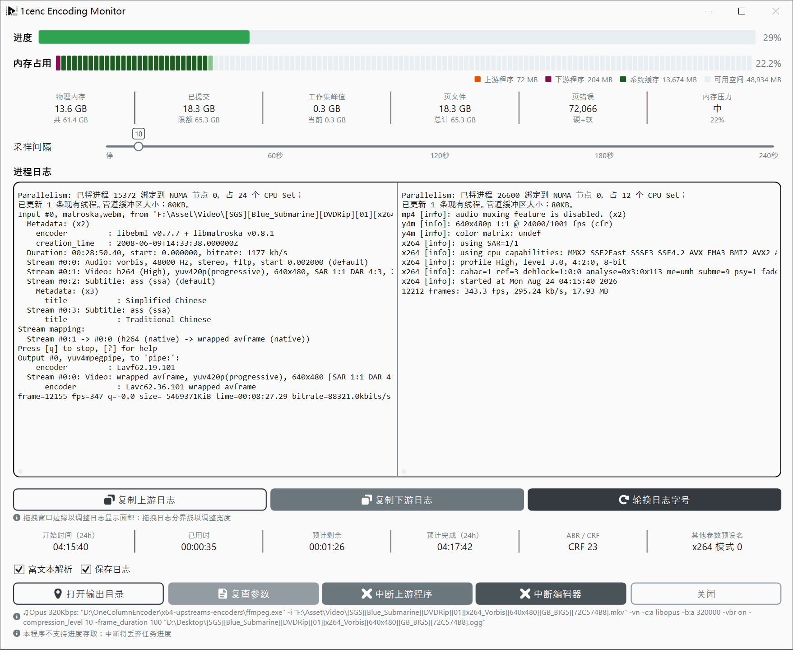

### 首次壓制——壓制監視器一覽

**進度條**
- 如果影片元數據中存在影片總幀數，則顯示進度，否則顯示理髮店燈柱動畫（完成時動畫停止）

**記憶體占用**
- 檢查當前電腦的記憶體大小是否存在瓶頸
- 檢查是否應該關閉一些程序來釋放更多記憶體
- 如果電腦有多個 NUMA 節點，則理論上還可以打開幾個壓制進程

**進程日誌**
- 左側為上遊程序（ffmpeg、VapourSynth、...）日誌
- 右側為下遊程序/編碼器日誌
- 中間的分隔線可以拖動，以擴大和縮小兩個窗口
- 底部的三個按鈕可以複製當前日誌文本，或輪換字號

**時間計算機**
- 查看用時，預計完成時間等時間狀態
- 如果影片元數據中不存在影片總幀數，則預計相關的時間資訊不做更新

**富文本解析**
- 識別字體、顏色等命令符號（SVT-AV1 會寫）

**保存日誌**
- 將此次壓制產生的進程日誌保存為 `1cenc` 目錄下的 `.txt` 文件

**瀏覽與進程操作**
- **中斷上游/下遊程序**
    - 上遊程序負責解碼，因此完成的幀數比下遊程序（編碼器）更多一些
    - 選擇取決於是否多壓制幾十幀（中斷上游）還是急停（中斷下游）
- **關閉**
    - 在上遊程序和下遊程序皆中斷/退出後解鎖

在編碼完成後，1cenc 會啟動自動封裝操作，從而產生第二段上遊程序的日誌內容：

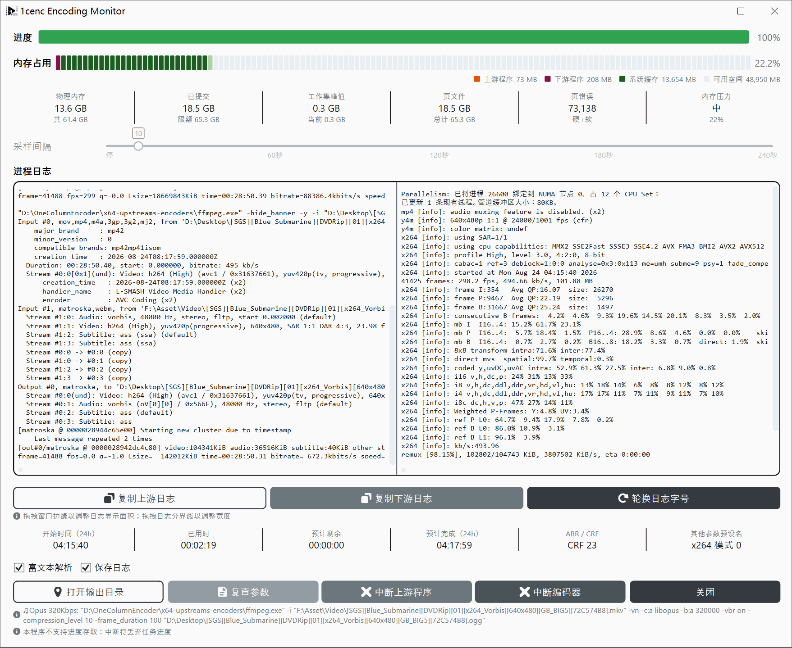

---

## 再次壓制（完整流程版）

***依照下圖的配置/點擊順序重新進行此次編碼：***

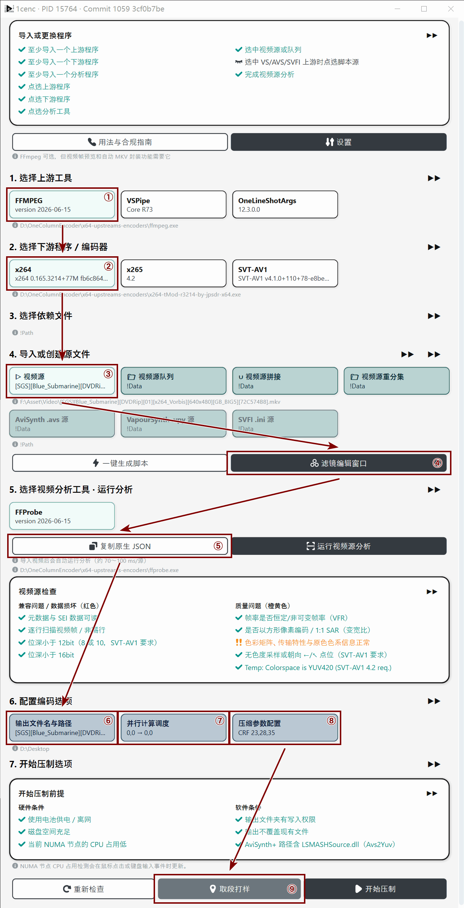

### 再次壓制 ④——濾鏡編輯器一覽

濾鏡編輯器中的一些命令行/腳本行基於分析數據生成，因此它的按鈕只有在完成了“運行影片源分析”後才會解鎖。
- 濾鏡編輯器會自動選擇標籤頁（此處上遊程序為 ffmpeg）

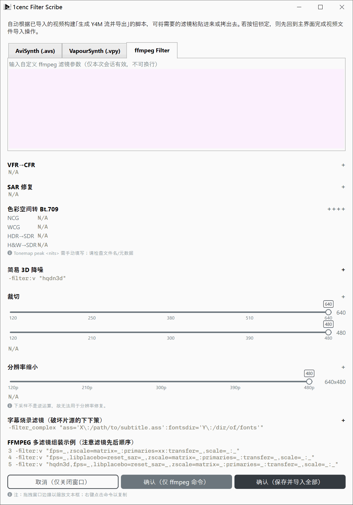

圖中大部分濾鏡參數都是“N/A”——因為影片源不需要這些修復，反之如果影片源是可變幀率、非方形象素（需修復 SAR）等情況，則會生成相應的濾鏡命令行。

***依照下圖控制解析度縮小命令，生成一個縮小命令，然後黏貼到頂部的濾鏡參數框裡，點擊確認。***

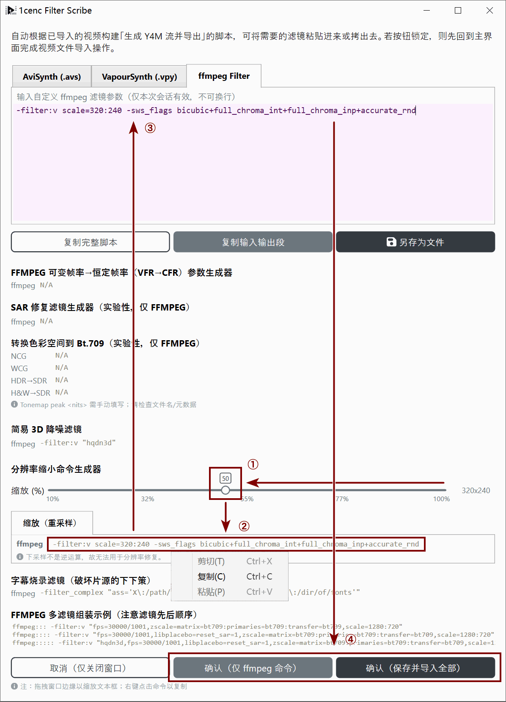

點擊確認保存時，會有一個“覆蓋 ffprobe JSON”的確認框出現，這是因為濾鏡會修改影片源的解析度，導致壓製參數構建的依據變更，而需手動校準一次。

***點擊“更新 ffprobe JSON”。***

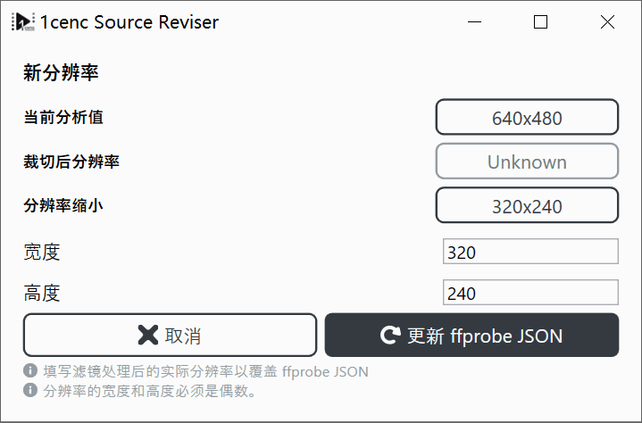

> 註：VapourSynth 濾鏡編輯器支持單幀濾鏡效果預覽

### 再次壓制 ⑤——複製原生 JSON

當 1cenc 做出了奇怪的檢查列表判斷，或者觸發預期外的警告時，可以透過它來排查。

***（可選）打開熟悉的文本編輯器，黏貼進去檢視一下***

### 再次壓制 ⑥——輸出檔案名與路徑

用於預覽檔案名在各種設備/UI 寬度限制下的最終呈現效果，同時避免因檔案名導致的壓制失敗可能，對於管理大量文件，或有發布需求的情況有用。

在此設定一個新的檔案名，並指定新的輸出位置

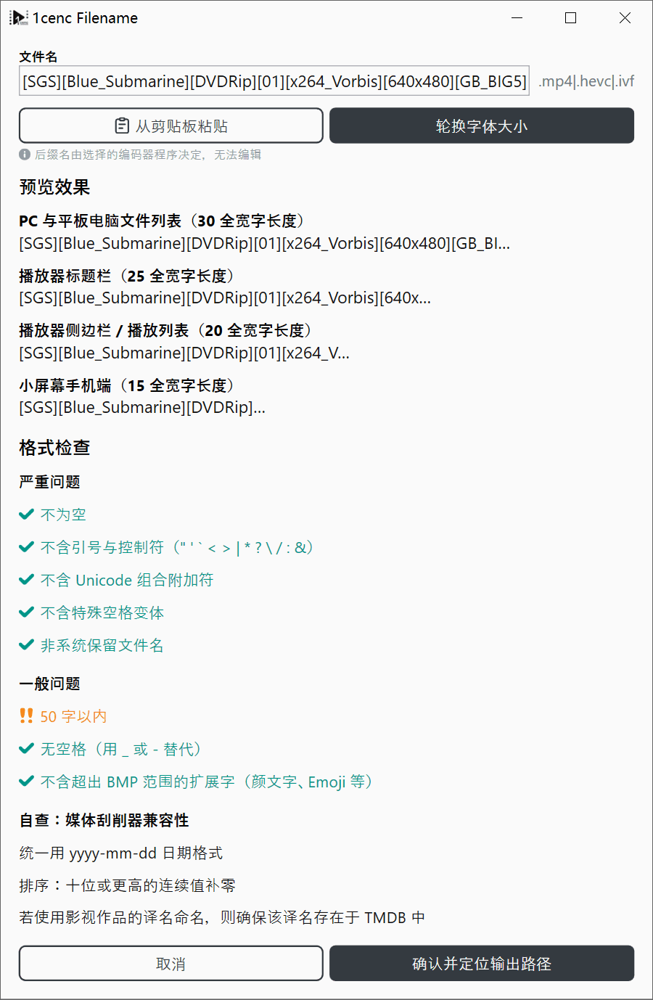

### 再次壓制 ⑦——平行計算調度

在此設置上遊程序和編碼器具體運行在哪個 NUMA 節點，在使用超過一路 CPU—記憶體節點的電腦，因為 BIOS 設置，或者使用 TR（執行緒撕裂者）、EPYC（霄龍）處理器時，就有機率暴露出超過一個節點的選項。

**限制上 | 下遊程序執行緒到物理核心數**
- 編碼器（下遊程序）是重計算、輕快取的程序（儘管快取量取決於影片解析度）
    - 限制到物理核心數後可以達成“HPC 關超執行緒策略”的提速，同時不浪費超執行緒所帶來的“輕計算、重快取”程序的低占用
- 這決定了 1cenc 比一般壓制軟體更快，更穩定

**管道緩衝區**
- 透過增加快取占用，避免性能瓶頸——理論上是這樣，實際測試中沒有顯著變化，也沒有負面影響，可以忽略。

***此處可以維持默認或勾選全部項目，然後確認***

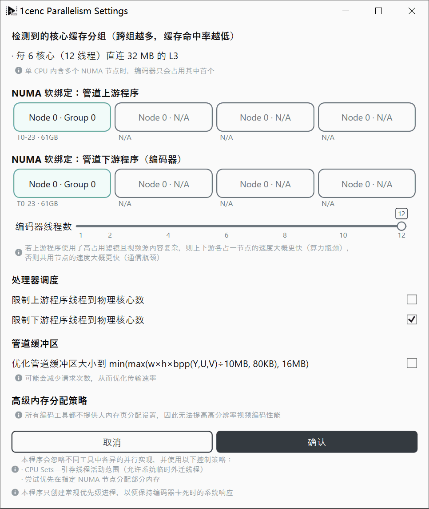

### 再次壓制 ⑧——壓縮參數配置（和預覽）

在此設置和預覽編碼器/下遊程序參數：
1. 根據（CRF 模式標籤頁底部的）**CRF 刻度**提示選一個合適的 CRF 值
2. **自訂參數——基礎參數**中選一個和影片源相關性最高的預設
3. **自訂參數——關鍵幀距離秒數**中根據下方提示選一個符合播下班況的值
4. （忽略其他設置項）
5. 在右側預覽窗底部點擊**預覽**，然後等一陣子
    1. 等待當前幀編碼完成
    2. （可選）等待右下角藍字的 SSIMULACRA、Butteraugli 畫質指標跑分運行完成
6. 拖動 SOURCE 和 ENCODE 之間的分隔線，從而精確對比二者
7. （可選）拖動**畫面位置**進度條，再次預覽
8. （可選）更換預覽窗左上角的**編碼器**，再次預覽

***根據此處說明調整 CRF 模式參數值、選擇基礎參數、關鍵幀距離後點擊左欄底部的確認***

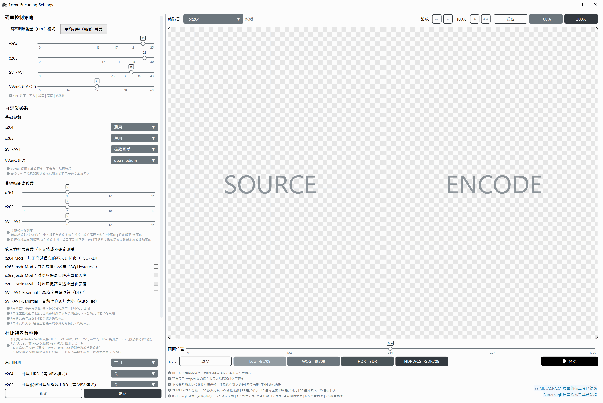

### 再次壓制——取段打樣

指定壓製影片的一段。此功能除了清理多餘的片頭片尾，也應對了有分享或者樣品考驗需求（如壓制組內審核流程），證明**主觀畫質正常**的用途。

***嘗試用時長滑條擴大片段到 60 秒，拖拽時間軸的黃色部分到片頭，點擊“開始打樣”***

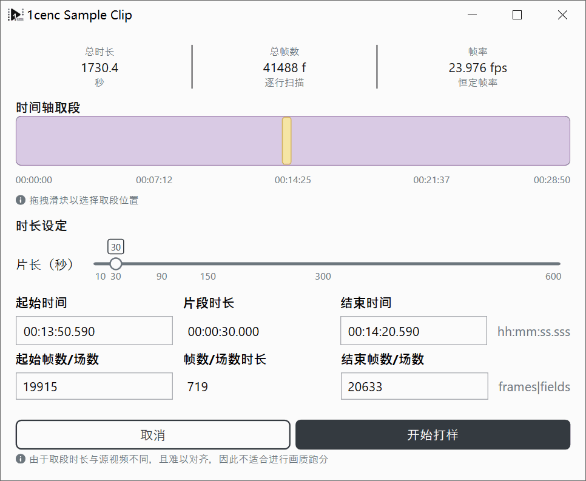

在確認“開始打樣”後，同樣會彈出一個除錯窗口，不過這次不會再出現封裝命令了。

***點擊確認，開始壓制***

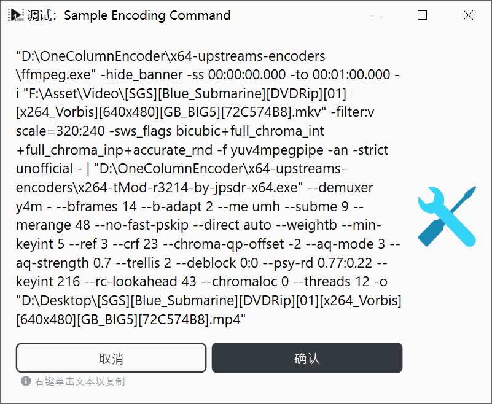

---

## 基本流程教學完

### 未提及內容（高級用例）

- 藍光章節導入
- 影片源隊列模式
- 影片源拼接模式
- 影片源重分集模式（基本分割、肉醬盤處理、合併盤處理）
- 基本 AviSynth 和 VapourSynth 濾鏡處理與隊列、拼接、重分集模式的變化
- 多 NUMA 節點的多開策略（標題 PID 號、源文件夾拆分、隊列拆分）