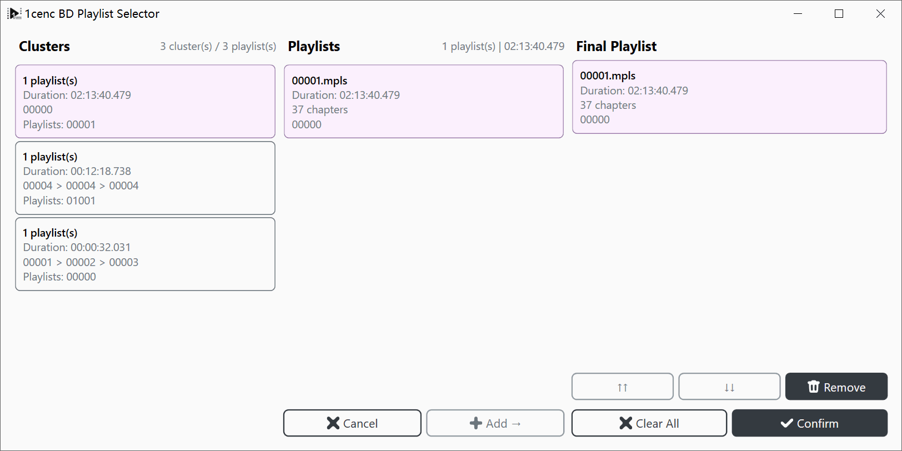

# 1cenc 高级流程使用教程

本文档用于说明适用于高级压制工作流的功能，以及队列模式的使用方法；本文的操作流程会写的偏详细，且会忽略可能与压制性能相关的使用建议。

## 如何反馈问题

通过 [GitHub Issues](https://github.com/iAvoe/OneColumnEncoder/issues) 或 [NazoRip 项目评论区](https://nazorip.site/archives/1593/) 可以反馈。反馈前请确认问题着实归咎于 1cenc，最好有截图、运行日志拷贝、ffprobe 日志之类的辅助信息，以便排查。

## 分身功能（Fork）

简单地说，分身是对软件当前完整状态的克隆，从而产生两个一模一样，无明显主次之分的运行实例。1cenc 可能是首个支持它的压制软件，但其概念并不新鲜，而是远在宗教传说、近在 Git（版本管理软件）中就有。

**实例（Instance）**
- 在计算机科学中，基于某种模型或蓝图的所创建的具体实现。这个实例通常与其他基于同一模型的实例有一个共同的数据结构，但储存在实例中的值是独立的——维基百科


> 分身功能的便利性来自于消除了“重复打开”和“重复配置”
> 区分运行实例的方法是观察任务栏和程序标题栏的 PID（进程号）

### 分身——基本操作流程
1. 将相同的配置项完成
    - 选择上游程序（滤镜工具）和下游程序（编码器）
    - 导入视频源
    - 按需完成通用的滤镜与压制配置
2. 根据需求分出数量足够的实例：
    - 2：无损压缩 | 有损压缩
    - 2: 烧录字幕 | 内封字幕
    - 4: x264-1080p | x264-720p | x265-1080p | x265-720p
    - N: 分为多个不同编码器参数值的版本，选出效果最好的结果或单纯用于测试
3. 分化各个实例的配置：
    - 按需分化滤镜与压制配置
    - 导出设置（Output Path and Filename）：设置导出不同的文件名

### 分身——NUMA 节点分配（可选）
1. 将相同的配置项完成
    - 选择上游程序（滤镜工具）和下游程序（编码器）
    - 导入队列模式（Queue Mode）或重分集模式（Repart Mode）的视频源（下面讲队列模式）
    - 按需完成通用的滤镜与压制配置
2. 根据已有的 NUMA 节点数量，分身出匹配数量的示例
3. 分化各个实例的配置：
    - 队列设置（Open Queue Editor）：选择性地删除重复的任务，让 N 个节点均匀分配任务
        - 可以通过“按文件大小排序”进一步优化任务分配，使得 N 个节点分到的工作量更加一致
    - 队列模式和重分集模式并不支持手动指定文件名，但这里消除了重复的队列任务，因此同样避免了覆盖
    - 并行计算设置（Parallelism Control）：分配不同实例到可独占的计算节点

> 购置 LGA3647 双节点平台的非理性缘由...？

### 分身——其它用途

**压制时回看：**
- 进入压制窗口时主界面会隐藏，因此如果有回看需求可以考虑打开

**热备份—热更新：**
- 使用不确定是否能跑的配置，或者单纯是以备不需而分身，以便在遇到问题时马上修正并重开

**密集调度：**
- 限制一个任务最多占 1~4 颗核心（或 AMD ZEN 架构 CPU 的单颗 CCD）
- 单个任务变慢，但改良的缓存调度开销会改善编码器冗余（无损压缩）能力，以及提升大批量任务的运行效率
- 高分辨率视频下可能会出现内存空间不足的问题

---

## 蓝光格式

**注意：传播碟片资源不一定合法，执行前应参考所在地区和资源本身的版权保护规定，例如超过版权保护期的资源。**

### 文件结构与压制模式判断

考虑到很多人大概率是第一次接触蓝光光盘，因此这部分会啰嗦一些，并且会含有很多“推测”和“结论”在内；已悉则可略。
- 以下文件结构由 `Get-PSTree` 列出

**基本结构：**
```
BDMV/
├─ index.bdmv        [入口] 标题索引/导航入口
├─ MovieObject.bdmv  [导航] 命令对象/播放控制
├─ PLAYLIST/         [播放列表] *.mpls，决定播放顺序
├─ CLIPINF/          [剪辑信息] *.clpi，与 m2ts 编号对应
├─ STREAM/           [实际流] *.m2ts ★按体积判断内容性质
├─ META/DL/          [元数据/商标] .xml/.jpg
├─ BACKUP/           [备份] 与关键文件重复，介绍时可省略
└─ CERTIFICATE/      [证书] id.bdmv，介绍时可省略
```

#### 番剧剧集文件结构

以一套 2 碟片多集 TV 动画为例，其中部分文件夹保持折叠以突出有效内容
```
        [BDMV][220705][One Piece：Season Eleven Voyage Nine (ep.733-746)][USA][Puto]
           ├── OnePiece_S11_V9_D1
           │   └── BDMV
 456.00  B │       ├── index.bdmv       [入口/导航]
 113.23 KB │       ├── MovieObject.bdmv [导航命令]
  93.82 KB │       ├── AUXDATA          [辅助数据：字体/音效/菜单]
 113.67 KB │       ├── BACKUP           [备份，省略]
  96.05 KB │       ├── CLIPINF          [剪辑信息] 00002~00064.clpi，与 m2ts 对应
           │       ├── META             [元数据]
  54.35 KB │       ├── PLAYLIST         [播放列表] 00001~00047.mpls，不完全与 m2ts 对应
  45.55 GB │       └── STREAM
  15.40 MB │           ├── 00002.m2ts
   2.04 MB │           ├── 00003.m2ts
  17.67 MB │           ├── 00004.m2ts
   6.51 MB │           ├── 00005.m2ts
   5.36 MB │           ├── 00006.m2ts
 102.00 KB │           ├── 00007.m2ts
   1.80 MB │           ├── 00010.m2ts
 276.00 KB │           ├── 00011.m2ts
  18.00 KB │           ├── 00012.m2ts
  18.00 KB │           ├── 00013.m2ts
   6.39 GB │           ├── 00014.m2ts  [大概率是正片] 推测为第 733 集，时长约 24 分钟
  54.31 MB │           ├── 00015.m2ts  [可能是预告图]
   6.39 GB │           ├── 00016.m2ts  [大概率是正片] 推测为第 734 集
  54.31 MB │           ├── 00017.m2ts  [可能是预告图]
   6.39 GB │           ├── 00018.m2ts  [大概率是正片] 推测为第 735 集
  54.35 MB │           ├── 00019.m2ts  [可能是预告图]
   6.39 GB │           ├── 00020.m2ts  [大概率是正片] 推测为第 736 集
  54.33 MB │           ├── 00021.m2ts  [可能是预告图]
   6.39 GB │           ├── 00022.m2ts  [大概率是正片] 推测为第 737 集
  54.30 MB │           ├── 00023.m2ts  [可能是预告图]
   6.39 GB │           ├── 00024.m2ts  [大概率是正片] 推测为第 738 集
   3.58 MB │           ├── 00025.m2ts
   5.36 MB │           ├── 00026.m2ts
   8.14 MB │           ├── ...（省略 19 个 8.14 MB 的文件：00027~00045；7 个 5.36 MB 的文件：00047~00053）
   8.14 MB │           ├── 00054.m2ts
  66.00 KB │           ├── 00055.m2ts
 216.00 KB │           ├── 00056.m2ts
  14.81 MB │           ├── 00057.m2ts
  54.33 MB │           ├── 00058.m2ts
   6.39 GB │           ├── 00059.m2ts  [大概率是正片] 推测为第 739 集
  54.28 MB │           ├── 00060.m2ts
 168.33 MB │           ├── 00063.m2ts
   1.80 MB │           └── 00064.m2ts
           └── OnePiece_S11_V9_D2
               └── ...（结构一致，文件太多，此处省略）
```

> 难点：不仔细看就可能会漏掉 `00059.m2ts`，导致“比别人少做一集”

**播放观察结果：**
- 正片猜测正确
- `00025~00055.m2ts` 都是黑屏
- 此前判断的“预告图”实际上是英文配音演员（和公司）的职员表（Credit）
  - 考虑到制作年代较老，额外添加职员表确实可以避免修改片源

**结论：已经正常分集，但由于动漫爱好者群体较为重视配音演员（声优）职员表，因此需要将额外的职员表拼接到正片片尾（需重分集模式）**

---

#### 演唱会文件结构

以一套 4 碟片演唱会为例，其中部分文件夹保持折叠以突出有效内容
```
        [BDMV][251008] 結束バンド TOUR “We will B”
           ├── Kessoku Band TOUR “We will B” DISC1
 554.00  B │   ├── BDMV
 120.00  B │   │   ├── index.bdmv
 434.00  B │   │   ├── MovieObject.bdmv
 554.00  B │   │   ├── BACKUP
  64.55 KB │   │   ├── CLIPINF
           │   │   ├── META
   1.64 KB │   │   ├── PLAYLIST
 334.00  B │   │   │   ├── 00000.mpls
 778.00  B │   │   │   ├── 00001.mpls
 566.00  B │   │   │   └── 01001.mpls
  43.78 GB │   │   └── STREAM
  42.38 GB │   │       ├── 00000.m2ts
  37.59 MB │   │       ├── 00001.m2ts
   7.81 MB │   │       ├── 00002.m2ts
  21.13 MB │   │       ├── 00003.m2ts
   1.33 GB │   │       ├── 00004.m2ts
 192.00 KB │   │       ├── 00005.m2ts
 264.00 KB │   │       └── 00006.m2ts
 104.00  B │   └── CERTIFICATE
           ├── Kessoku Band TOUR “We will B” DISC2
 862.00  B │   ├── BDMV
 144.00  B │   │   ├── ...
 718.00  B │   │   ├── MovieObject.bdmv
 862.00  B │   │   ├── BACKUP
  49.75 KB │   │   ├── CLIPINF
           │   │   ├── META
   1.92 KB │   │   ├── PLAYLIST
 334.00  B │   │   │   ├── 00000.mpls
 548.00  B │   │   │   ├── 00001.mpls
 338.00  B │   │   │   ├── 00002.mpls
 324.00  B │   │   │   ├── 00003.mpls
 422.00  B │   │   │   └── 01001.mpls
  29.53 GB │   │   └── STREAM
  16.88 GB │   │       ├── 00000.m2ts
  37.59 MB │   │       ├── 00001.m2ts
   7.81 MB │   │       ├── 00002.m2ts
  21.13 MB │   │       ├── 00003.m2ts
   1.27 GB │   │       ├── 00004.m2ts
  11.31 GB │   │       ├── 00005.m2ts
  30.00 KB │   │       ├── 00006.m2ts
  30.00 KB │   │       └── 00008.m2ts
 104.00  B │   └── CERTIFICATE
           ├── Kessoku Band TOUR “We will B” DISC3
 554.00  B │   ├── BDMV
 120.00  B │   │   ├── index.bdmv
 434.00  B │   │   ├── MovieObject.bdmv
 554.00  B │   │   ├── BACKUP
  50.93 KB │   │   ├── CLIPINF
           │   │   ├── META
   1.31 KB │   │   ├── PLAYLIST
 334.00  B │   │   │   ├── 00000.mpls
 590.00  B │   │   │   ├── 00001.mpls
 422.00  B │   │   │   └── 01001.mpls
  31.41 GB │   │   └── STREAM
  30.35 GB │   │       ├── 00000.m2ts
  37.59 MB │   │       ├── 00001.m2ts
   7.81 MB │   │       ├── 00002.m2ts
  21.13 MB │   │       ├── 00003.m2ts
1020.69 MB │   │       ├── 00004.m2ts
 102.00 KB │   │       ├── 00005.m2ts
 132.00 KB │   │       └── 00006.m2ts
 104.00  B │   └── CERTIFICATE
           └── Kessoku Band TOUR “We will B” DISC4
 862.00  B     ├── BDMV
 144.00  B     │   ├── index.bdmv
 718.00  B     │   ├── MovieObject.bdmv
 862.00  B     │   ├── BACKUP
               │   ├── META
   1.91 KB     │   ├── PLAYLIST
 334.00  B     │   │   ├── 00000.mpls
 590.00  B     │   │   ├── 00001.mpls
 366.00  B     │   │   ├── 00002.mpls
 338.00  B     │   │   ├── 00003.mpls
 324.00  B     │   │   └── 01001.mpls
  24.63 GB     │   └── STREAM
  11.64 GB     │       ├── 00000.m2ts
  37.59 MB     │       ├── 00001.m2ts
   7.81 MB     │       ├── 00002.m2ts
  21.13 MB     │       ├── 00003.m2ts
   1.50 GB     │       ├── 00004.m2ts
  11.42 GB     │       ├── 00005.m2ts
  30.00 KB     │       ├── 00006.m2ts
  30.00 KB     │       └── 00008.m2ts
 104.00  B     └── CERTIFICATE
```

> 难点：文件路径同时含双引号和空格，用命令行工具写出来的难度很高

根据以上文件大小推测的视频内容类型，从文件大小可以发现一些细节
- DISC1 和 DISC3、DISC2 和 DISC4 的视频大小分布结构最相似
- 如果是完整不间断的长视频，那么 DISC2 的结构应该和 DISC1 结构一致
    - **初步结论：有必要进行播放观察，看看怎么个事**
```
DISC1 BDMV/STREAM/
00000.m2ts  42.38 GB   [正片/演唱会主体]
00001.m2ts  37.59 MB   [公共短片段：菜单/警告/logo]
00002.m2ts   7.81 MB   [公共短片段]
00003.m2ts  21.13 MB   [公共短片段]
00004.m2ts   1.33 GB   [特典/广告/菜单视频]
00005.m2ts  192 KB     [小图标/占位/通常不可播放]
00006.m2ts  264 KB     [小图标/占位/通常不可播放]

DISC2 BDMV/STREAM/
00000.m2ts  16.88 GB   [正片/主内容 A]
00001.m2ts  37.59 MB   [公共短片段：菜单/警告/logo]
00002.m2ts   7.81 MB   [公共短片段]
00003.m2ts  21.13 MB   [公共短片段]
00004.m2ts   1.27 GB   [特典/广告/菜单视频]
00005.m2ts  11.31 GB   [正片/主内容 B 或 长特典]
00006.m2ts  30 KB      [小图标/占位/通常不可播放]
00008.m2ts  30 KB      [小图标/占位/通常不可播放]

DISC3 BDMV/STREAM/
00000.m2ts  30.35 GB   [正片/演唱会主体]
00001.m2ts  37.59 MB   [公共短片段：菜单/警告/logo]
00002.m2ts   7.81 MB   [公共短片段]
00003.m2ts  21.13 MB   [公共短片段]
00004.m2ts  1020.69 MB [约 1GB：菜单/短特典/广告]
00005.m2ts  102 KB     [小图标/占位/通常不可播放]
00006.m2ts  132 KB     [小图标/占位/通常不可播放]

DISC4 BDMV/STREAM/
00000.m2ts  11.64 GB   [正片/主内容 A]
00001.m2ts  37.59 MB   [公共短片段：菜单/警告/logo]
00002.m2ts   7.81 MB   [公共短片段]
00003.m2ts  21.13 MB   [公共短片段]
00004.m2ts   1.50 GB   [特典/广告/菜单视频]
00005.m2ts  11.42 GB   [正片/主内容 B 或 长特典]
00006.m2ts  30 KB      [小图标/占位/通常不可播放]
00008.m2ts  30 KB      [小图标/占位/通常不可播放]
```

**播放观察结果：**
- DISC1：演唱会上半场
- DISC2：中场休息排练和采访
- DISC3：演唱会下半场
- DISC4：另一场演唱会的上、下半场（~~可能...是凑数的~~）

**结论：已经正常分集，无需拼接或拆分（单视频模式，队列模式已经够用，用不到重分集模式）**

---

#### 电影文件结构 1

以一套 4 碟片演唱会为例，其中部分文件夹保持折叠以突出有效内容，并直接将播放观察结果标记在路径下
```
        [BDMV][210623]スーパー戦隊MOVIEレンジャー2021 コレクターズパック 豪華版[Blu-ray]
   3.00 GB ├── DISC 2.iso
   3.13 GB ├── DISC 3.iso
           ├── DISC 1
   2.06 KB │   ├── BDMV
 276.00  B │   │   ├── ...
           │   │   ├── META
   8.37 KB │   │   ├── PLAYLIST
  43.31 GB │   │   └── STREAM
   8.53 GB │   │       ├── 00000.m2ts [电影正片]（压缩率意外的高...因为全片仅 38 分钟）
  48.00 KB │   │       ├── 00001.m2ts
   3.27 GB │   │       ├── 00002.m2ts [特别篇]（也算内容）
 373.99 MB │   │       ├── 00003.m2ts [片头曲音乐 MV]
 209.58 MB │   │       ├── 00004.m2ts [片尾曲音乐 MV]
 522.00 KB │   │       ├── 00005.m2ts
 498.00 KB │   │       ├── 00006.m2ts
 522.00 KB │   │       ├── 00007.m2ts
  48.00 KB │   │       ├── 00008.m2ts
 384.00 KB │   │       ├── 00009.m2ts
   4.58 GB │   │       ├── 00010.m2ts [舞台见面会 1]
   3.63 GB │   │       ├── 00011.m2ts [舞台见面会 2]（1 的一个月后）
   1.36 GB │   │       ├── 00012.m2ts [短预告]
   6.52 GB │   │       ├── 00013.m2ts [正片花絮]
   6.34 GB │   │       ├── 00014.m2ts [长预告]
 385.13 MB │   │       ├── 00015.m2ts [猜测：特别篇]（短）
 122.64 MB │   │       ├── 00016.m2ts [广告]
   3.23 GB │   │       ├── 00017.m2ts [公开纪念会 1]（舞台见面会 2 之前）
   4.26 GB │   │       ├── 00018.m2ts [公开纪念会 2]（...反正就是要开会...）
 366.00 KB │   │       ├── 00019.m2ts
 378.00 KB │   │       ├── 00020.m2ts
 360.00 KB │   │       ├── 00021.m2ts
 390.00 KB │   │       ├── 00022.m2ts
 480.00 KB │   │       ├── 00023.m2ts
 270.00 KB │   │       ├── 00024.m2ts
 444.00 KB │   │       ├── 00025.m2ts
   8.41 MB │   │       ├── 00028.m2ts
 433.17 MB │   │       ├── 00029.m2ts [猜测：Menu]
  67.64 MB │   │       ├── 00030.m2ts
   8.96 MB │   │       ├── 00031.m2ts
   2.26 MB │   │       ├── 00032.m2ts
   2.25 MB │   │       └── 00033.m2ts
 104.00  B │   └── CERTIFICATE
 320.67 MB ├── SCANS
  96.94 MB └── 特典CD
```

> 难点：DISC2、3 并非蓝光盘，而是 DVD 结构

**播放观察结果：**DISC2、3 是制作成 DVD 的 DISC1（正片、特别篇）

**结论：已经正常分集，无需拼接或拆分（队列模式已经够用，用不到重分集模式）**

#### 电影文件结构 2

以一部番剧转电影片源为例，其中部分文件夹保持折叠以突出有效内容，并直接将播放观察结果标记在路径下
```
        Shakugan.no.Shana.The.Movie.2007.ANiME.DUAL.COMPLETE.BLURAY-ANiMEHD
   2.85 KB ├── BDMV
 264.00  B │   ├── index.bdmv
   2.59 KB │   ├── MovieObject.bdmv
   2.85 KB │   ├── BACKUP
  51.27 KB │   ├── CLIPINF
   5.29 KB │   ├── PLAYLIST
  20.78 GB │   └── STREAM
 255.62 MB │       ├── 00000.m2ts [猜测：Menu]
   2.60 MB │       ├── 00002.m2ts
   5.27 MB │       ├── 00003.m2ts
   5.44 MB │       ├── 00004.m2ts
   5.71 MB │       ├── 00005.m2ts
   2.55 MB │       ├── 00010.m2ts
  17.28 GB │       ├── 00012.m2ts [正片]
   5.07 MB │       ├── 00013.m2ts
 193.61 MB │       ├── 00014.m2ts
 217.07 MB │       ├── 00015.m2ts
 284.91 MB │       ├── 00016.m2ts
  73.76 MB │       ├── 00017.m2ts
 103.01 MB │       ├── 00018.m2ts
 259.05 MB │       ├── 00019.m2ts
 317.54 MB │       ├── 00020.m2ts
 170.98 MB │       ├── 00021.m2ts
 177.29 MB │       ├── 00022.m2ts
   1.21 GB │       ├── 00023.m2ts [片头曲音乐 MV]
 250.35 MB │       ├── 00024.m2ts
  11.37 MB │       └── 00025.m2ts
 104.00  B └── CERTIFICATE
```

**结论：已经正常分集，无需拼接或拆分（队列模式已经够用，用不到重分集模式）**

---

## 蓝光播放列表选择器

通过 ChapterTools Core，读取蓝光文件结构的播放列表（PLAYLIST）文件夹，提供总结出的所有播放列表和子列表，通过选择需要的列表来构建压制队列或重分集队列。

### PLAYLIST (.mpls)

播放列表文件。一个 `.mpls` 通常定义**一个 Playlist**，Playlist 再按顺序引用一个或多个 `.m2ts` Clip，并指定其中使用的视频、音频、字幕等 Stream。

根据 Playlist 的组织方式和用途，常见结构可归纳为：

#### 一视频、多字幕

多个 Playlist 指向**相同的视频**，但选择不同的字幕/音轨组合
* **一文件多列表**：一个 `.mpls` 内存在多个 Playlist，分别选择不同字幕
* **多文件一列表**：多个 `.mpls` 分别包含一个 Playlist，均指向相同的视频 Clip，但选择不同字幕
* **特征**：
  * 各 Playlist 的播放时长基本相同
  * 引用的 `.m2ts` 文件高度重合
  * 主要差异通常在字幕、音频等 Stream 选择

#### 正片、花絮

不同 Playlist 分别对应正片、演唱会主体、特典、幕后花絮等独立内容

* **一文件多列表**：一个 `.mpls` 内包含多个 Playlist，分别指向不同内容
* **多文件一列表**：多个 `.mpls` 各自对应一个内容
* **特征**：
  * 正片通常具有**最长的播放时长**
  * 电影、演唱会通常 Playlist 较少，且单个 Playlist 引用的 Clip 数量相对集中
  * 番剧通常存在多个时长相近的 Playlist
  * 番剧的 Playlist/Clip 编号常具有一定的连续或周期性规律
  * 单个 Playlist 引用的 Clip 数量可能超过 4，用于组成一整集内容

#### 广告、MV、短篇
广告、音乐视频（MV）、宣传片、短特典等较短内容。

* **常见情况**：一个 `.mpls` 对应一个主要 Playlist
* **特征**：
  * 播放时长明显短于正片
  * 通常只引用少量 `.m2ts` Clip
  * Playlist/Clip 编号有时存在较弱的连续或分组规律
  * 在番剧 BD 中，也可能表现为 OP、ED、PV、CM 等独立短篇内容

> **注意：**以上是纯靠经验判断经验（猜），并非是任何分类规则。同一种内容可能采用不同的组织方式，因此应结合播放时长、Clip 引用关系、流选择以及编号规律综合判断。

---

### 导入蓝光播放列表

在 1cenc 主界面点击“队列模式”，在“是否导入蓝光”对话框中选择“确认”，选中一个蓝光盘体文件夹结构中的 `PLAYLIST` 文件夹并按确认，即可打开播放列表选择器：



图中是之前的 `Kessoku Band TOU R“We will B” DISC1` 播放列表读取结果，最终检测到 3 个列表，其中时长最长的自然是正片。

---

## 队列模式

### 队列模式——滤镜编辑器

---

## ？？教程完

### 未提及内容（高级用例）
- 视频源拼接模式
- 视频源重分集模式（基本分割、肉酱盘重分集、合并盘重分集）
- 基本 AviSynth 和 VapourSynth 滤镜处理与队列、拼接、重分集模式的变化
- 多 NUMA 节点的多开策略（标题 PID 号、源文件夹拆分、队列拆分）